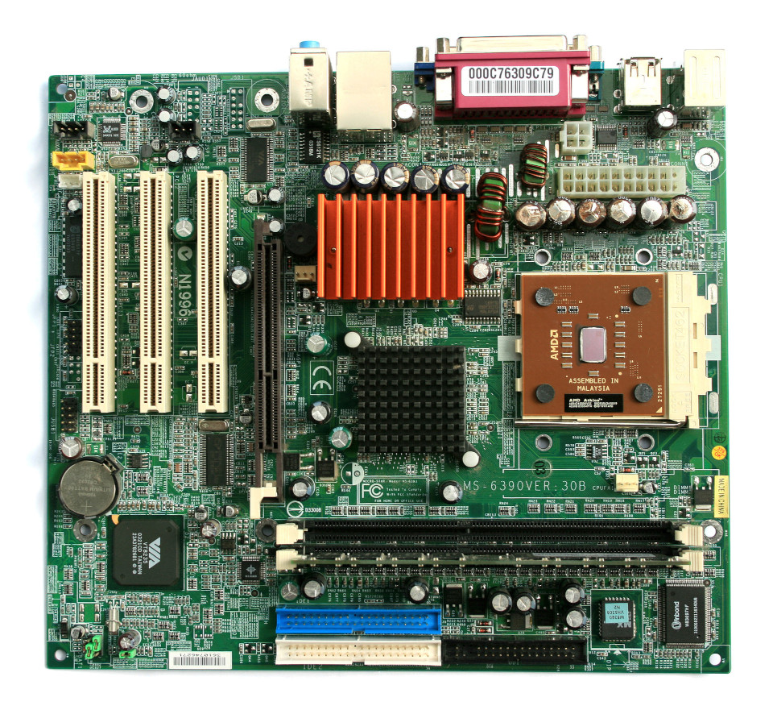
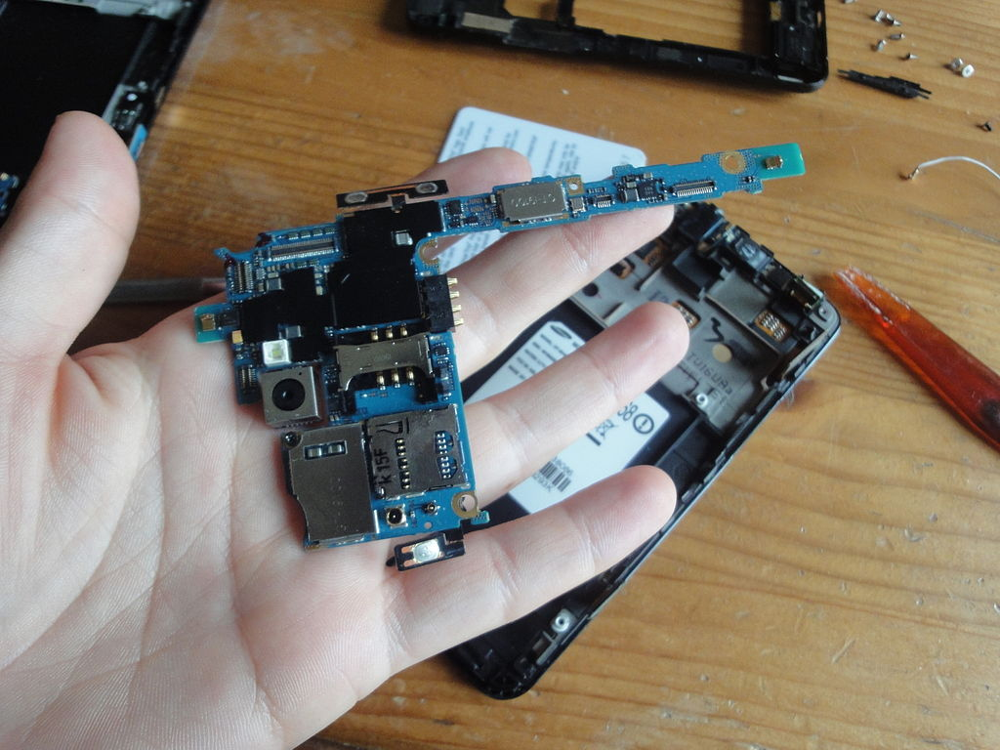
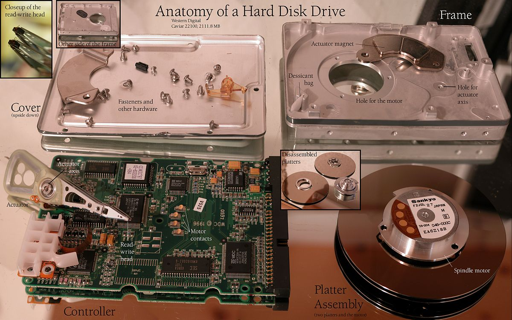
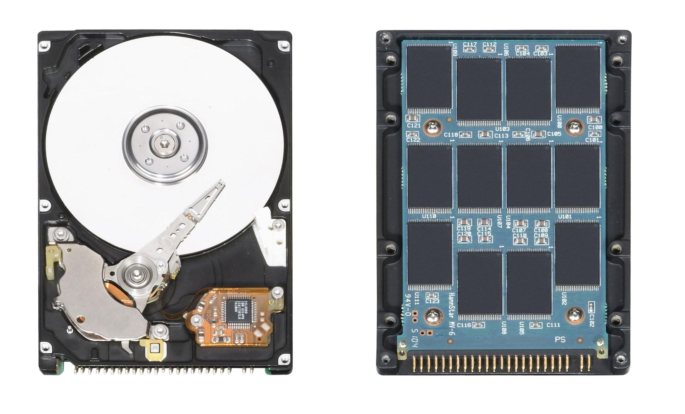
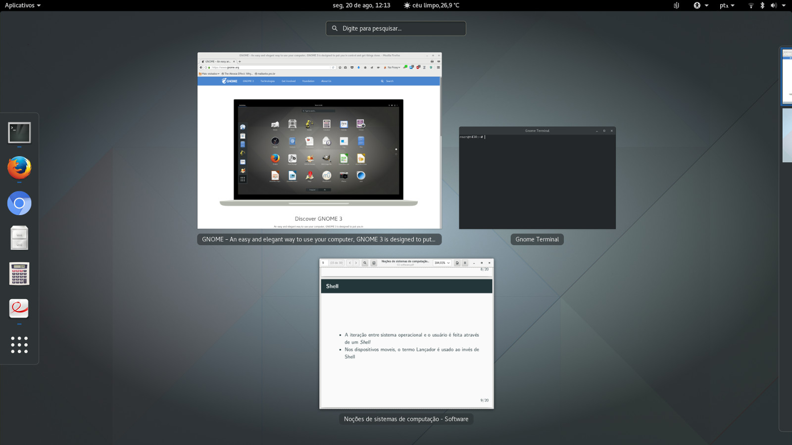
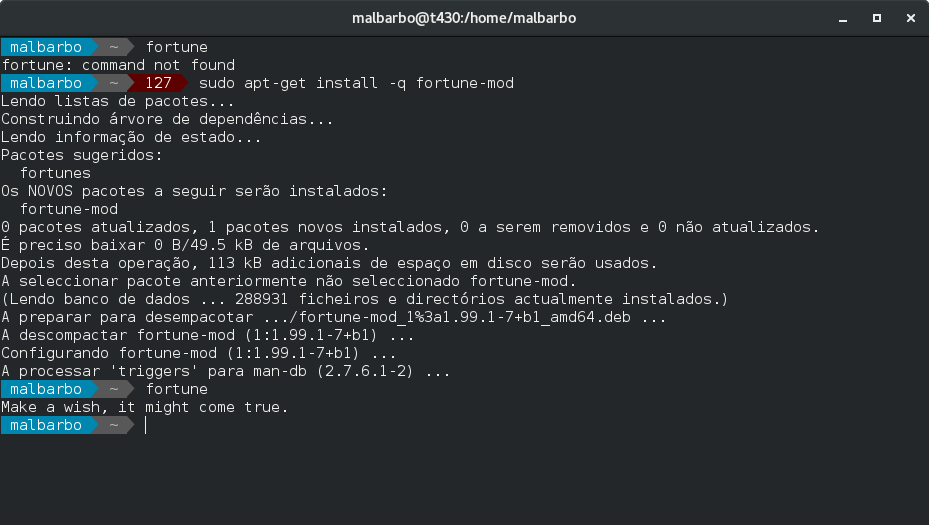
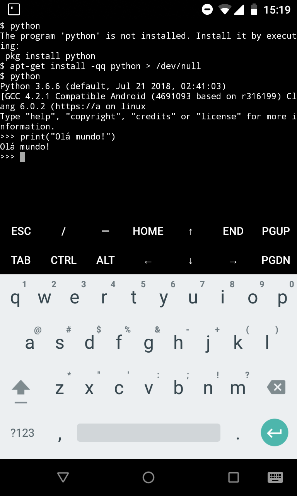
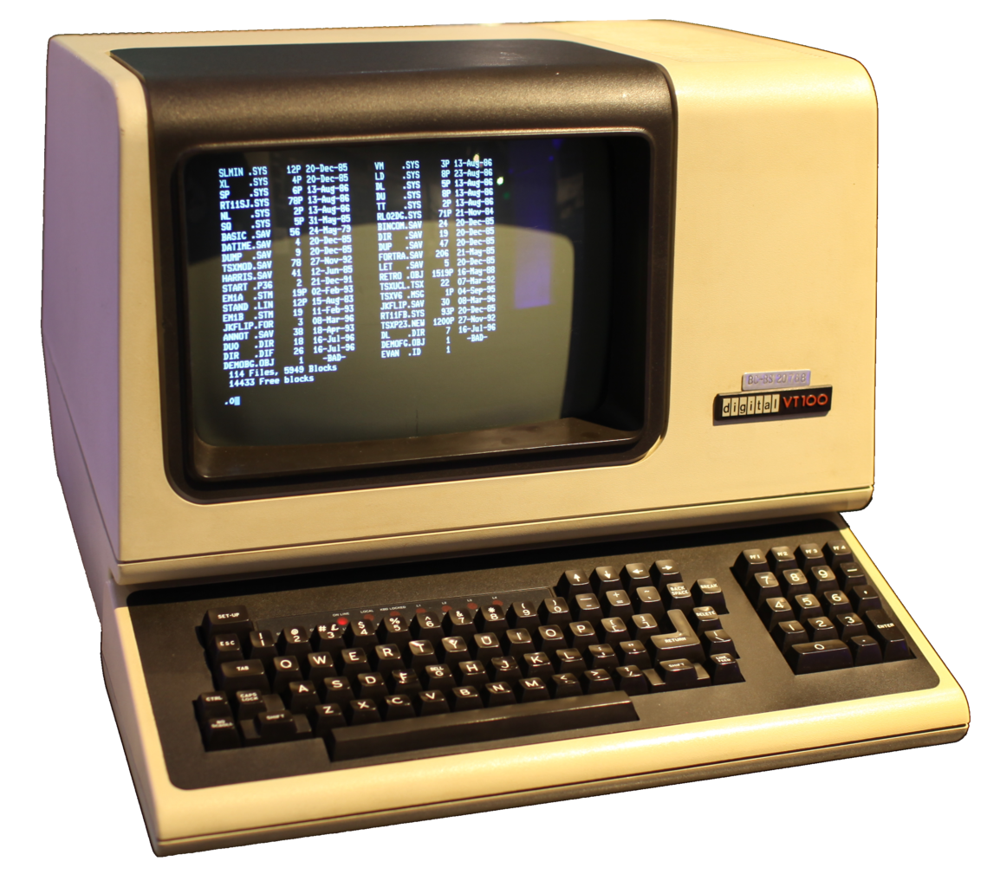

# Introdução

## Introdução

O que é um computador? \pause

- No passado: uma pessoa que faz cálculos (computa) \pause

- Atualmente: uma máquina que pode ser programada para executar sequências de instruções (operações lógicas e aritméticas) automaticamente

## Introdução

O que é um software? \pause

Uma coleção de instruções que dizem o que um computador deve fazer.

## Introdução

O que é um sistema computacional? \pause

- Um conjunto completo de elementos que permite o uso do computador \pause

- Inclui hardware e software

## Exemplos

Propósito geral \pause

- Computadores pessoais
- _Smartphones_
- _Tablets_

\pause

Propósito específico

- Tocador de música
- Eletrodomésticos
- Automóveis
- Controle industrial

## Funcionamento básico

Como funciona um sistema computacional? \pause

- Entrada
- Processamento
- Saída

# Hardware

## Hardware

Componentes \pause

- Dispositivos de entrada/saída
- Dispositivos de armazenamento
- Memória
- Processador

\pause

A interligação entre esses componentes é feita pela placa-mãe.

## Placa-mãe de um computador de mesa

{ width=7.5cm }

## Placa-mãe de um _smartphone_

{ width=7.5cm }

## Componentes / Dispositivos de entrada

Fornecem dados para serem processadas e armazenados. \pause Exemplos \pause

- Teclado
- Mouse
- Microfone
- Câmera
- Sensores
- Tela sensível ao toque

## Componentes / Dispositivos de saída

Apresentam ou transmitem dados recuperados do armazenamento e resultados do processamento. \pause Exemplos \pause

- Monitor
- Impressora
- Auto falante
- Atuadores

## Componentes / Dispositivos de entrada e saída

Dispositivos híbridos \pause

- Adaptadores de rede
- Dispositivos de armazenamento

## Componentes / Dispositivos de armazenamento

Retêm dados para recuperação posterior. \pause Exemplos \pause

- Eletrônico \pause
    - ROMs (memória apenas para leitura)
    - SSD (disco de estado sólido) \pause
- Magnético \pause
    - Disquetes (discos flexíveis)
    - HDD (discos rígidos) \pause
- Óptico
    - CD
    - DVD

## Componentes de um HDD

{ width=10cm }

## Funcionamentos de um HDD

Vídeos mostrando o funcionamentos de um HDD

- \url{https://en.wikipedia.org/wiki/File:HardDisk1.ogv}

- \url{https://en.wikipedia.org/wiki/File:Harddrive-engineerguy.ogv} (Você pode escolher a legenda em português clicando em cc)

## HDD vs SDD

{ width=10cm }

## HDD vs SDD

SSD

- Mais rápido
- Menor capacidade
- Mais caro

HDD

- Mais lento
- Maior capacidade
- Mais barato

## Componentes / Memória

Memória principal \pause

- Armazena informações para uso imediato
- Volátil (requer energia para manter os dados armazenados) \pause
- Mais rápida do que os dispositivos de armazenamento

## Componentes / Processador

Processador ou CPU (unidade central de processamento) \pause

- Registradores
    - Memória muito rápida que armazena os operandos e os resultados das operações
- Unidade lógica e aritmética (ULA)
    - Lê os operandos dos registradores
    - Executa operações
    - Grava o resultado nos registradores
- Unidade de controle
    - Coordena a leitura das instruções da memória e execução pela ULA

\pause

{ width=6cm }

## Hierarquia de memória

Por que existem tantos tipos de memória? \pause

Porque cada uma tem características específicas de capacidade, velocidade e custo.

## Hierarquia de memória

{ width=8cm }

## Conjunto de instruções

Cada processador executa um conjunto específico de instruções (descrito por uma arquitetura) \pause

- X86, AMD64 (computadores em geral)
- Arm, Aarch64 (dispositivos portáteis)
- Mips (roteadores)

# Software

## Licença

Antes de conversarmos sobre diferentes aspectos dos softwares, vamos falar de licença de software. \pause

O que é uma licença de software? \pause

É um documento que descreve um contrato entre o fornecedor do software e o usuário do software.

## Tipos de software

De forma geral, os software podem ser classificadas de acordo com a sua licença em

- Software proprietário

- Software livre

## Tipos de software

Software proprietário

- Restringe de alguma maneira a execução, distribuição, modificação, etc.

- Suporte ao usuário geralmente fornecido pela empresa que vende/distribui o software. \pause

- Variantes: shareware, adware, etc. \pause

Exemplos \pause

- Photoshop

- Microsoft Office

- Google Chrome

## Tipos de software

Software livre

- Permite a execução, redistribuição, modificação do código, etc.

- Algumas licenças requerem a redistribuição do código se ele for modificado.

- Suporte ao usuário geralmente fornecido pela comunidade de usuários e desenvolvedores \pause

Exemplos \pause

- Gimp

- Libreoffice

- Mozilla Firefox

## {.plain}

{width=9cm}

## Boot

Qual é o primeiro programa executado quando ligamos o computador? \pause

- Firmware (BIOS ou UEFI) \pause

E depois? \pause

- Sistema Operacional

## Sistema Operacional

Quais são os papéis do sistema operacional? \pause

- Gerenciar os recursos do sistema computacional \pause

- Prover serviços para outros softwares \pause

Alguns componentes \pause

- Kernel (gerência de processos, memória, entrada/saída, etc)

- Interface com o usuário (shell)

## {.plain}

{height=7cm}

## Sistema Operacional

Exemplos de sistemas operacionais proprietários \pause

- Windows 10 \pause

- macOS, iOS \pause

- Android, ChromeOS \pause

Exemplos de sistemas operacionais livres \pause

- Linux (Debian, Ubuntu, Android, ChromeOS, etc) \pause

- FreeBSD, OpenBSD, NetBSD \pause

- FreeDOS, ReactOS

## {.plain}

{height=6cm}

{height=6cm}

{height=6cm}

## Shell

A iteração entre o sistema operacional e o usuário final é feita através de um _Shell_ (lançador em dispositivos móveis).

Um _Shell_ pode oferecer uma interface gráfica ou interface textual. \pause

Quais as principais características de cada tipo de interface?

## Shell

Shell Gráfico \pause

- Geralmente utilizam a metáfora de área de trabalho \pause
- Facilidade de uso e aprendizado \pause
- Menos poderosos \pause

Shell Texto \pause

- Comandos descritos por texto
- Mais difíceis de aprender
- Mais ágeis
- Mais poderosos

## Shell Gráfico

## Shell Texto

{ width=7cm }

{ width=3cm }

## Terminal

{width=7cm}

