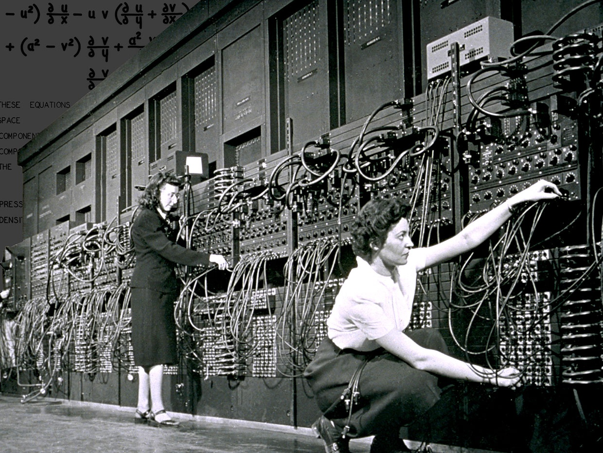

# Introdução

Fundamentos de Algoritmos \pause

- Resolver problemas projetando programas que sejam bem escritos e funcionem corretamente. \pause

O que são algoritmos e qual a relação deles com resolução de problemas e programas de computadores? \pause

O que é um algoritmo?


# Definições de algoritmo

## Dicionário Silveira Bueno

> Conjunto predeterminado e definido de regras e processos destinados à solução de um problema, com um número finito de etapas.

\pause

## Dicionário Merriam-Webster

> Um procedimento passo a passo para resolver um problema ou atingir um objetivo.

\pause

## Forbellone e Eberspächer

> Uma sequência de passos que visam atingir um objetivo bem definido.

\pause

## Knuth

> Um conjunto finito de regras que fornece uma sequência de operações para resolver um tipo específico de problema.

\pause

O que estas definições tem em comum?


# Definição de Algoritmo

O que estas definições tem em comum? \pause

- Sequência de etapas/passos/operações \pause

- Resolução de um problema \pause

Então, qual a relação de algoritmo e resolução de problemas e programas de computadores? \pause

- Processos de resolução de problemas podem ser descritos com algoritmos. \pause

E a relação com programas de computadores? \pause

- Algoritmos podem ser implementados como programas de computadores (embora algoritmos possam ser usados em diversos contextos, estamos interessados apenas naqueles que podem ser executados por computadores)


# Algoritmos

Como expressar um algoritmo? \pause

- Descrição textual

- Fluxograma

- Pseudocódigo

- Funções matemáticas

- Etc


# Instruções

Para cada algoritmo a seguir, vamos \pause

- Ler o algoritmo \pause

- Tentar executar o algoritmo \pause

- Tentar descobrir o propósito do algoritmo


# Algoritmo 1 - Descrição textual

Considere a tabela ao lado.

<div class="columns">
<div class="column" width="50%">
Marque a linha 1 da tabela como linha de referência.

Olhando para a linha de referência e para as linhas que estão após ela, procure pela linha com a coluna **B** com maior valor e troque de lugar o conteúdo dessa linha com o conteúdo da linha de referência.

Se existe uma linha após a linha de referência, considere essa próxima linha como referência e repita o processo, senão pare.
</div>

<div class="column" width="50%">
_     |A       | B
------|--------|-------
**1** |Paula   | 8
**2** |Jorge   | 10
**3** |Maria   | 7
**4** |José    | 6
**5** |Ana     | 9
**6** |Mário   | 8

</div>
</div>


# Algoritmo 2 - Fluxograma

Usando $N = 4$ e $C = 1$, faça

{width=7cm}


# Algoritmo 3 - Pseudocódigo

Passo 0:

- Comece com $A = 52$ e $B = 36$

Passo 1:

- Se $A < B$, troque o valor de $A$ por $B$ e vice-versa

Passo 2:

- Se $B = 0$, então pare e dê como saída o valor de $A$
- Senão
    - $C \leftarrow A - B$
    - $A \leftarrow B$
    - $B \leftarrow C$
    - Repita o passo 1


# Algoritmo 4 - Função matemática

Calcule o valor de $f([2, 1, 4, 1, 2])$

$$f(x) = \begin{cases}
0 & \text{se } num\_itens(x) = 0 \\
primeiro(x) + f(sem\_primeiro(x)) & \text{caso contrário}
\end{cases}$$


# Propósitos

Qual o propósito de cada algoritmo? \pause

1) Organizar os nomes em ordem decrescente de pontos \pause

2) Calcular a raiz quadrada (método de Newton) \pause

3) Encontrar o MDC de dois números (algoritmo de Euclides) \pause

4) Somar os valores de uma lista


# Algoritmos

O que foi necessário para entender/executar esses algoritmos? \pause

- Entender a notação \pause

- Entender a semântica \pause

- Entender o modelo de execução


# Algoritmos

<div class="columns">
<div class="column" width="50%">
O que esses algoritmos têm em comum? \pause

- Entrada e saída \pause

- Ações (processamento) \pause

    - Cálculo de valores \pause

    - Escolha entre ações \pause

    - Repetição de ações \pause

- Uso de memória \pause
</div>
<div class="column" width="50%">

</div>
</div>


# Limite dos algoritmos

Todos os problemas podem ser resolvidos com algoritmos? \pause

O que é um problema? \pause

Vamos considerar apenas problemas bem definidos, que especificam com precisão quais são as possíveis entradas e como as saídas estão relacionados com as entradas. \pause

Todos os problemas bem especificados podem ser resolvidos com algoritmos? \pause

O que significa dizer que um algoritmo resolve um problema? \pause Que para todas as entradas possíveis, o algoritmo produz a saída correta. \pause

E então, todos os problemas bem especificados podem ser resolvidos com algoritmos? \pause Não... \pause

Os problemas que podem ser resolvidos com algoritmos são chamados de problemas computáveis.


# Avaliação de algoritmos

Pode existir mais que um algoritmo que resolve o mesmo problema? \pause Sim. \pause

O que considerar na escolha ou no projeto de algoritmos? \pause

- Simplicidade \pause

- Uso de recursos (tempo de processamento, memória, energia, etc) \pause

- Corretude e/ou precisão


# Algoritmos e computadores

Qual representação utilizar para escrever algoritmos que possam ser executados por um computador? \pause


Mas o que é uma linguagem e qual a sua função? \pause

Um sistema estruturado para comunicação.


# Linguagens

Podemos utilizar o português para programar um computador? \pause

Não, porque o computador não entende o português! \pause Ainda que o computador entendesse o português, ele não seria uma linguagem adequada para programação porque não é preciso o bastante. \pause

E que linguagem o computador entende? \pause

Cada tipo de computador entende uma linguagem específica, a sua linguagem de máquina. \pause

Então, precisamos programar um computador usando sua linguagem de máquina? \pause

Hoje em dia não, mas os primeiros computadores eram programados usando linguagem de máquina!

# {.plain}




# Tradução

Se não queremos utilizar linguagem de máquina, como podemos programar os computadores? \pause Como duas entidades que usam linguagens diferentes podem se comunicar? \pause

Usando um tradutor.\pause

Se a linguagem fonte e a linguagem alvo forem bem definidas, podemos escrever um programa que faça a tradução de forma automática. \pause A linguagem alvo (de máquina) é bem definida, precisamos de uma linguagem fonte (de programação) que também seja bem definida.


# Linguagem de programação

Uma **linguagem de programação** é uma linguagem formal (bem definida) adequada para programar computadores. \pause

Uma linguagem de programação é caracterizada por diversos aspectos, entre eles a sintaxe, a semântica e o modo de execução.


# Sintaxe

A **sintaxe** de uma linguagem é o conjunto de regras que define como os símbolos podem ser agrupados para criar as sentenças na linguagem. \pause

Por exemplo, a instrução para soma de dois número é expressa: \pause

- Na maioria das linguagens: `20 + 17`{.python} \pause
- Em Lisp: `(+ 20 17)`{.scheme}


# Semântica

A **semântica** de uma linguagem define o significado das construções da linguagem. \pause

A expressão `12 + "3"`{.python} é valida sintaticamente em muitas linguagens, mas o significado é diferente entre elas. \pause

- Lua: o texto `"3"`{.python} deve ser convertido para um número e depois somado com `12`{.python}. \pause
- Javascrip: o número `12`{.python} deve ser transformado para um texto e depois juntado com `"3"`{.python}. \pause
- Na maioria linguagens: é um erro semântico.


# Modo de execução

Os dois principais **modos de execução** das linguagens de programação são a compilação e a interpretação. \pause

Em uma linguagem compilada o código do programa é primeiro traduzido (compilado) para código de máquina e posteriormente executado. \pause

Em uma linguagem interpretada o código do programa é lido, traduzido e executado diretamente pelo interpretador.


# Exemplo C++

<div class="columns">
<div class="column" width="50%">

Exemplo em C++ - Raiz quadrada

Parte do arquivo `raiz.cpp`

\small

```cpp
// Entrada
double n = stof(argv[1]);
double c = stof(argv[2]);

// Processamento
while (abs(c * c - n) >= 0.1) {
    double c_ = (c + n / c) / 2;
    c = c_;
}

// Saída
cout << c << endl;
```

\pause
</div>
<div class="column" width="50%">
\small

**Windows**

Compilação

```
g++ -o raiz.exe raiz.cpp
```

\pause


Execução

```
> raiz.exe 4 1
2.00061
```

\pause

**Linux**

Compilação

```
g++ -o raiz raiz.cpp
```

\pause


Execução

```
> ./raiz 4 1
2.00061
```
</div>
</div>


# Exemplo Python

<div class="columns">
<div class="column" width="50%">

Exemplo em Python - MDC

Parte do arquivo `mdc.py`

\footnotesize

```python
# Entrada
a = int(sys.argv[1])
b = int(sys.argv[2])
# Processamento
if a < b:
    a, b = b, a
while b != 0:
    c = a - b
    a = b
    b = c
    if a < b:
        a, b = b, a
# Saída
print(a)
```

\pause
</div>
<div class="column" width="50%">
Interpretação

```
> python3 mdc.py 52 36
4
```

</div>
</div>


# Escolhendo uma linguagem

Existem centenas de linguagens de programação, cada uma com suas próprias características e usos, então, qual delas aprender? \pause

Nenhuma em particular. \pause O mais importante não são as linguagens em si, mas os princípios que são utilizados para criar os programas nas linguagens. \pause

Dominando os fundamentos de algoritmos e paradigmas de programação, aprender uma nova linguagem não é uma tarefa difícil!


# Escolhendo uma linguagem

Mas precisamos de uma linguagem para começar. \pause Nessa disciplina vamos utilizar a linguagem Python! \pause

Python é uma linguagem bastante utilizada e versátil, \pause mas também é uma linguagem extensa! \pause Mas não se preocupe, vamos utilizar apenas construções básicas! \pause

Vamos começar?


# Atividades

@. Tente relacionar as construções do fluxograma do algoritmo que calcula a raiz quadrada com as construções do código em C++.

@. Tente relacionar as construções do pseudo código que calcula o MDC com as construções do código em Python.

@. Uma linguagem pode surgir a partir de processos naturais?
