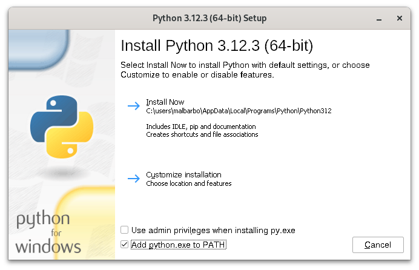
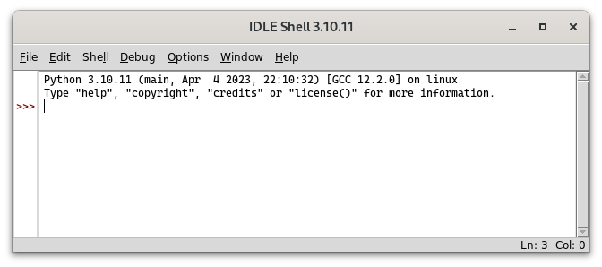
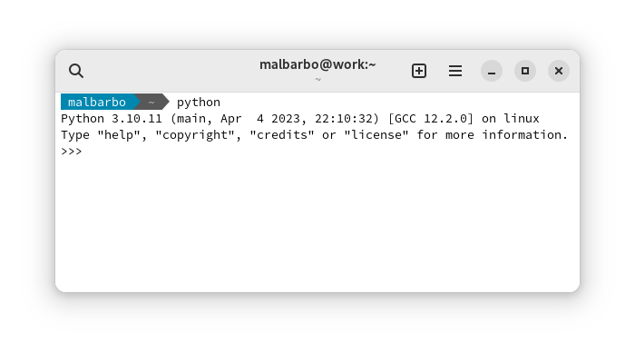
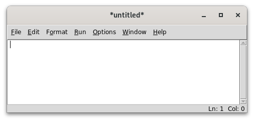
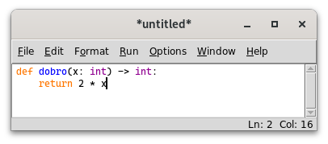
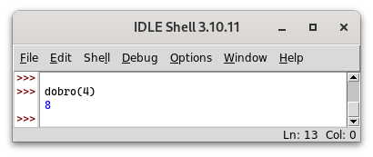
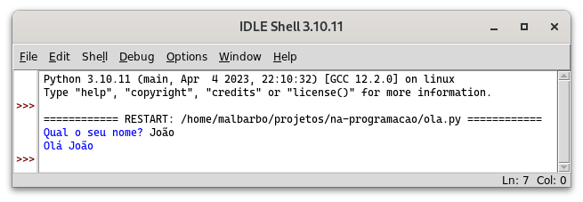
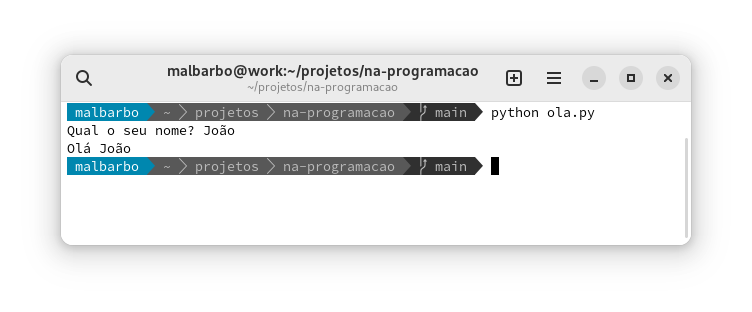
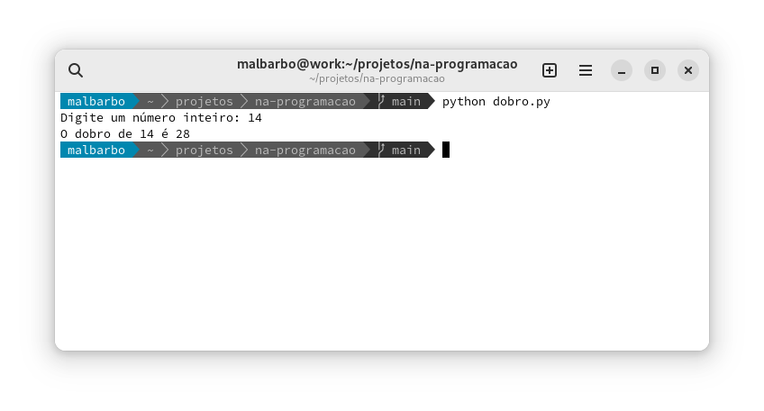

# Introdução

Até o momento nós estudamos alguns aspectos de

- Sistemas computacionais
- Algoritmos
- Linguagens de programação

\pause

Agora vamos ver as construções básicas da linguagem Python, para em seguida começarmos a estudar o processo de projeto de programas.


# Instalação

O Python é um software livre e pode ser baixado e instalado de <https://python.org>. \pause

Além do interpretador, a instalação do Python vem com um ambiente de desenvolvimento e aprendizagem chamado IDLE. \pause

Em um sistema Linux, é provável que o Python já venha instalador por padrão. Nesse caso é preciso instalar apenas o IDLE. \pause Em um sistema baseado no Debian, use o comando

```bash
$ sudo apt install idle
```


# Instalação

Durante a instalação no Windows é importante marcar a opção "Add python.exe to PATH".

{width=10cm}


# IDLE

Ao iniciar o IDLE a janela a seguir é exibida \pause

{width=10cm}


# Janela de interações (REPL)

Utilizamos essa janela, chamada de janela de **interações** (ou REPL), para testar pequenos trechos de código. \pause

O símbolo `>>>` é chamado de _prompt_ e indica que o interpretador está pronto.


# Janela de interações (REPL)

As interações acontecem da seguinte forma

- Digitamos um trecho de código (_Read_)
- O código é avaliado (_Eval_)
- O resultado é mostrado na tela (_Print_)
- O processo se repete (_Loop_)

\pause

Exemplo de interação

```python
>>> 3 * 4
12
```


# Janela de interações (REPL)

O modo de interações também pode ser iniciado executado `python` no terminal de comandos. \pause

{width=10cm}


# Observação

Note que na janela de interações não criamos programas para serem utilizados por usuários, mas experimentamos aspectos do Python e testamos os nossos programas. \pause

Veremos posteriormente como criar programas completos. \pause

Agora vamos explorar o Python!


# Tipos de dados e operações pré-definidas

A primeira coisa que aprendemos de uma linguagem de programação são os tipos de valores (tipos de dados) e operações já disponíveis na linguagem. \pause

Os primeiros computadores foram criados para fazerem cálculos matemáticos, então vamos começar com isso.


# Números

O Python tem diversos **tipos numéricos**, os dois principais são \pause

<div class="columns">
<div class="column" width="50%">

Inteiros (`int`{.python}) \pause

\small

```python
>>> 102
102
>>> -18
-18
```

\pause

</div>
<div class="column" width="50%">

Ponto flutuante (`float`{.python}), representação aproximada de números reais \pause

\small

```python
>>> 1.3
1.3
>>> 0.345
0.345
>>> # Notação científica
>>> 1.23e2 # 1.23 * 10^2
123.0
```

</div>
</div>

\pause

Podemos usar as quatro operações aritméticas básicas com esses tipos numéricos e algumas outras operações.


# Operadores básicas

<div class="columns">
<div class="column" width="50%">

\small

```python
>>> # Soma e subtração
>>> 4 + 2
6
>>> 4 + 2.0 - 5
1.0
```

\pause

```python
>>> # Multiplicação e divisão
>>> 3 * 5.0
15.0
>>> 7 / 2
3.5
```

\pause

```python
>>> # Divisão sempre produz float
>>> 8 / 4
2.0
```
</div>
<div class="column" width="50%">
\pause

\small

```python
>>> # Piso da divisão
>>> 7 // 2
3
>>> 5 // 1.3
3.0
```

\pause

```python
>>> # Módulo
>>> 14 % 3
2
>>> -14 % 3
1
```

\pause

```python
>>> # float é uma aproximação dos reais
>>> 5 % 1.3
1.0999999999999999
```

</div>
</div>


# Comentários

O símbolo `#`{.python} (cerquilha), é utilizado para indicar um **comentário**. O comentário inicia na `#`{.python} e vai até o final da linha. Os comentários são ignorados pelo interpretador do Python, mas são utilizados para adicionar informações relevantes para os leitores do código.


# Exponenciação
\small

```python
>>> # Exponenciação e radiciação
>>> 3 ** 4 # 3 elevado a 4
81
>>> 2 ** 80
1208925819614629174706176
>>> # raiz quadrada, o mesmo que 16 ** (1 / 2)
>>> 16 ** 0.5
4.0
```

\pause

```python
>>> # A exponenciação tem prioridade sobre a divisão
>>> # O mesmo que (27 ** 1) / 3
>>> 27 ** 1 / 3
9.0
>>> # Usamos parênteses para mudar a prioridade
>>> 27 ** (1 / 3) # raiz cubica
3.0
```


# Prioridades

O Python utiliza a mesma precedência que estamos acostumados na matemática. Podemos usar o acrônimo PEMDAS para lembrar das prioridades

- **P**arênteses
- **E**xponenciação
- **M**ultiplicação e **D**ivisão
- **A**dição e **S**ubtração

Operadores com a mesma precedência são avaliados da esquerda para a direita, exceto a exponenciação, que é da direita para a esquerda.


# Exercício

Qual é o resultado da avaliação de cada expressão a seguir?

\small

```python
>>> 15 // 7

>>> 15 % 7

>>> 12 // 27

>>> 12 % 27

>>> 3 * 4 - 5 / (8 // 3)

>>> 5 * 8 // 3 / 4 % 3

>>> 2 ** 2 ** 3 // 4 * 3

```


# Exercício

Qual é o resultado da avaliação de cada expressão a seguir?

\small

```python
>>> 15 // 7
2
>>> 15 % 7
1
>>> 12 // 27
0
>>> 12 % 27
12
>>> 3 * 4 - 5 / (8 // 3)
9.5
>>> 5 * 8 // 3 / 4 % 3
0.25
>>> 2 ** 2 ** 3 // 4 * 3
192
```


# Conversão

<div class="columns">
<div class="column" width="50%">
\small

```python
>>> # Arredondamento
>>> round(3.4)
3
>>> round(3.5)
4
>>> round(-1.6)
-2
>>> round(3.5134, 2)
3.51
```

\pause

</div>
<div class="column" width="50%">

\small

```python
>>> # Conversão entre int e float
>>> int(7.6)
7
>>> int(-2.3)
-2
>>> float(4)
4.0
```

</div>
</div>


# Módulos

As operações que vimos até agora estão disponíveis automaticamente, outras operações estão disponíveis em módulos, que devem ser importados antes de poderem ser utilizados. \pause

O Python tem uma [extensa](https://xkcd.com/353/) biblioteca padrão, com muitos módulos, este é um dos motivos pelos quais a linguagem é bastante utilizada. A documentação da biblioteca padrão do Python está disponível em <https://docs.python.org/3/library/index.html>. \pause

Por hora, vamos ver apenas algumas funções do módulo [`math`](https://docs.python.org/3/library/math.html).


# Piso e teto

\small

```python
>>> # Importação do módulo
>>> import math
```

\pause

<div class="columns">
<div class="column" width="50%">

\small

```python
>>> # Piso
>>> # maior inteiro <= ao número
>>> math.floor(4.2)
4
>>> math.floor(4.0)
4
>>> math.floor(-2.3)
-3
```

\pause

</div>
<div class="column" width="50%">

\small

```python
>>> # Teto
>>> # menor inteiro >= ao númeo
>>> math.ceil(4.2)
5
>>> math.ceil(4.0)
4
>>> math.ceil(-2.3)
-2
```

</div>
</div>


# Cadeia de caracteres

Outro tipo de dado pré-definido em Python é a cadeia de caracteres (`str`{.python}), _string_ em inglês. \pause

Geralmente usamos strings para armazenar informações simbólicas, como por exemplo palavras e textos. \pause

Uma string em Python é escrita entre apóstrofo (`'`{.python}) ou aspas (`"`{.python}) \pause

\small

```python
>>> 'casa'
'casa'
>>> "gota d'agua"
"gota d'agua"
>>> "mesa"
'mesa'
```


# Operações com strings

Assim como existem operações pré-definidas para números, também existem operações pré-definidas para strings. \pause

<div class="columns">
<div class="column" width="50%">

\small

```python
>>> # Concatenação
>>> 'casa' + ' da ' + 'sogra'
'casa da sogra'
```

\pause

```python
>>> # Repetição
>>> 'abc' * 3
'abcabcabc'
```

\pause

```python
>>> 'algum' * 0
''
>>> 'algum' * -4
''
```

\pause

</div>
<div class="column" width="50%">

\small

```python
>>> # Quantidade de caracteres
>>> len('ciência da computação')
21
```

\pause

```python
>>> # Conversão maiúscula
>>> 'José'.upper() # ou str.upper('José')
'JOSÉ'
```

\pause

```python
>>> # Conversão minúscula
>>> 'José'.lower() # ou str.lower('José')
'josé'
```

</div>
</div>


# Substrings

\small

```python
>>> # Indexação de caractere
>>> # O primeiro caractere tem índice 0
>>> 'casa'[0] # ou str.__getitem__('casa', 0)
'c'
```

\pause

```python
>>> 'casa'[1]
'a'
```

\pause

```python
>>> # Acesso de índice fora do intervalo
>>> 'casa'[4]
Traceback (most recent call last):
  File "<stdin>", line 1, in <module>
IndexError: string index out of range
```


# Substrings

\small

```python
>>> # Substring do início até 3 - 1
>>> 'veja isso'[:3] # ou str.__getitem__('veja isso', slice(None, 3))
'vej'
```

\pause

```python
>>> # Substring de 4 até o final
>>> 'veja isso'[4:] # ou str.__getitem__('veja isso', slice(4, None))
' isso'
```

\pause

```python
>>> # Substring de 2 até 6 - 1
>>> 'veja isso'[2:6] # ou str.__getitem__('veja isso', slice(2, 6))
'ja i'
```


# Conversão entre strings e números

<div class="columns">
<div class="column" width="50%">

\small

```python
>>> # Conversão de int para str
>>> str(127)
'127'
>>> # Conversão de float para str
>>> str(4.1)
'4.1'
```

\pause

```python
>>> # Concatenação de str e int
>>> 'Idade: ' + str(19)
'Idade: 19'
```

\pause

</div>
<div class="column" width="50%">

\small

```python
>>> # Conversão de str para int
>>> int('127')
127
```

\pause

```python
>>> # Conversão de str para float
>>> float('25')
25.0
>>> float('12.67')
12.67
```

</div>
</div>


# Formas de expressões

Inicialmente as expressões que vimos usavam apenas operadores matemáticos \pause

```python
30 * 2
```

\pause

Depois vimos que as expressões podem conter chamadas de funções \pause

```python
round(3.5)
```

\pause

e chamadas de métodos

```python
'José'.lower()
```

\pause

Por fim, vimos que strings podem ser indexadas \pause

```python
'veja isso'[2:6]
```


# Formas de expressões

Embora a forma de utilizar operadores, funções, métodos e indexação seja diferente, o propósito dessas construções é o mesmo: computar valores de saída a partir de valores de entrada.


# Formas de expressões

<div class="columns">
<div class="column" width="40%">
\includegraphics[trim=20pt 0pt 20pt 0pt,clip]{imagens/operacoes-entrada-saida.pdf}
</div>
<div class="column" width="60%">
\small
Se o propósito é o mesmo, por que não usar a mesma forma? \pause

Por conveniência! \pause

Por exemplo, se não tivéssemos a forma de operadores e apenas a forma de chamada de funções, então, para escrever a expressão `30 * 2 + 3`{.python} teríamos que escrever \pause

```python
int.__add__(int.__mul__(30, 2), 3)
```

\pause

Além da conveniência de escrita, a forma de chamada métodos e indexação tem outras vantagens, que não vamos discutir nessa disciplina.
</div>
</div>


# Exercício

Qual é o resultado de cada expressão a seguir?

\small

```python
>>> len('casa') * 'x'

>>> str(10) + 2 * '*' + str(2.0)

>>> 'Jose da Silva'[:4].upper()

>>> 'Jose da Silva'[8:].lower()

>>> str(int('12') * 100)[1:3]

>>> int(('1' * 3 + 3 * '2').upper()[2:4])

```


# Exercício

Qual é o resultado de cada expressão a seguir?

\small

```python
>>> len('casa') * 'x'
'xxxx'
>>> str(10) + 2 * '*' + str(2.0)
'10**2.0'
>>> 'Jose da Silva'[:4].upper()
'JOSE'
>>> 'Jose da Silva'[8:].lower()
'silva'
>>> str(int('12') * 100)[1:3]
'20'
>>> int(('1' * 3 + 3 * '2').upper()[2:4])
12
```


# Definição de funções

Além de podermos usar as operações e funções pré-definidas no Python, também podemos definir as nossas próprias funções.

\pause

Apesar de ser possível definir uma nova função na janela de interações, nós vamos fazer isso na janela de edição de código. Isso permite salvar o código para uso/edição posterior.


# Definição de funções

Para abrir a janela de edição de código selecionamos o menu File $\rightarrow$ New File (crtl + n). \pause

{width=9cm}


# Definição de funções

Funções na programação são semelhantes as funções na matemática, discutiremos as diferenças ao longo da disciplina. \pause Por ora, vamos ver uma função matemática e tentar escrever "a mesma" função em Python. \pause

Considere a função $f: \mathbb{Z} \rightarrow \mathbb{Z}$, que associa cada número inteiro ao dobro do seu valor, isto é, $f(x) = 2x$. \pause

Quais são as partes que podemos identificar nessa definição? \pause

- O nome da função ($f$) \pause
- O nome do argumento de entrada ($x$) e seu domínio ($\mathbb{Z}$) \pause (conjunto dos valores da entrada) \pause
- O contradomínio ($\mathbb{Z}$) \pause (conjunto dos valores da saída) \pause
- A expressão que define a função ($2x$) \pause

Vamos definir essa mesma função em Python.


# Definição de funções

O que precisamos para definir a função? \pause

- O nome da função (`dobro`) \pause
- O nome e tipo da entrada (`x: int`{.python}) \pause
- O tipo da saída (`int`{.python}) \pause
- O corpo da função, isto é, as instruções que calculam o valor da saída a partir da entrada (`2 * x`{.python}) \pause

Para definir a função, usamos uma forma (sintaxe) específica: \pause

\small

```python
def dobro(x: int) -> int:
    return 2 * x
```


# Definição de funções

<div class="columns">
<div class="column" width="48%">
Escrevemos o código na janela de edição de código e salvamos o arquivo (File $\rightarrow$ Save - crtl\ +\ s).

{width=6.5cm}

\pause
</div>
<div class="column" width="48%">

Para testarmos a função executamos o arquivo (Run $\rightarrow$ Run Module - F5) e chamamos a função na janela de interações. \pause

{width=6.5cm}
</div>
</div>


# Definição de funções

A forma geral para definição de funções:

\small

```python
def nome(entrada1: tipo, entrada2: tipo, ...) -> tipo:
    return exp
```

\pause

<div class="columns">
<div class="column" width="48%">

`def`{.python} e `return`{.python} são **palavras chaves** (reservadas) e têm um significado pré-definido: \pause `def`{.python} indica a definição de uma função; \pause e `return`{.python} indica qual é a saída da função. \pause

Os quatros espaços em branco antes do `return`{.python} é chamado de **indentação** (ou recuo). Em algumas linguagens a indentação é opcional, mas em Python é obrigatória. \pause

Os símbolos `(`, `)`, `:`, `,` e `->`, entre outros, são os **delimitadores**.

\pause

</div>
<div class="column" width="48%">

Uma função pode ter zero ou mais parâmetros, mas conceitualmente só tem um valor de retorno. \pause

O **identificador** (nome) da função, dos parâmetros e dos tipos deve começar com uma letra ou `_` e pode ser seguido de letras, números e `_`. \pause

Espaços não podem ser usados em nomes. \pause

As letras diacríticas (acentos, cedilha, etc) podem ser usados nos identificados, mas não é uma boa prática, por isso não vamos utilizar.

</div>
</div>


# Exercício

Escreva uma função chamada `polegadas_em_mm` que converte uma medida `x` em polegadas para milímetros com até duas casas de precisão. Uma polegada equivale a 2,54 cm. Veja se a função funciona corretamente para os seguintes exemplos:

<div class="columns">
<div class="column" width="48%">

\small

```python
>>> polegadas_em_mm(10)
254.0
>>> polegadas_em_mm(1/2)
12.7
>>> polegadas_em_mm(5/8)
15.88
```

\pause
</div>
<div class="column" width="48%">

\small

```python
def polegadas_em_mm(x: float) -> float:
    return x * 2.54
```

A função está correta? \pause Não!. \pause

```python
def polegadas_em_mm(x: float) -> float:
    return x * 25.4
```

E esta? \pause Não, o último exemplo falha. \pause

```python
def polegadas_em_mm(x: float) -> float:
    return round(x * 25.4, 2)
```

</div>
</div>


<!--
# Diferenças entre a janela de interações e a de edição de código

O que acontece se escrevermos uma chamada função `dobro` após a sua definição e executarmos o arquivo (Run Module)?

\small

```python
def dobro(x: int) -> int:
    return 2 * x

dobro(4)
```

\pause

\normalsize

A função `dobro` será executada para o valor `4`{.python} mais nenhum resultado será exibido na tela. \pause

Por que na execução do exemplo na janela de interações o resultado é exibido e aqui não? \pause

Por que no modo de interação a exibição é feita automaticamente (o P -- _print_ -- de REPL) para facilitar a interação com o Python. \pause No arquivo de código, precisamos indicar explicitamente que queremos que o resultado seja exibido.
-->


# Operadores relacionais

Outro tipo de operação que podemos fazer com números e strings são as operações relacionais. \pause

Os **operadores relacionais** determinam se uma relação entre dois valores é verdadeira ou falsa. \pause

Que resposta você espera para a comparação `3 > 4`{.python}? \pause E para `3 < 4`{.python}? \pause

Em Python a resposta da primeira comparação é `False`{.python} (falso) e da segunda `True`{.python} (verdadeiro). \pause

\small

```python
>>> 3 > 4
False
>>> 3 < 4
True
```


# Operadores relacionais

Na computação os valores verdadeiro e falso são chamados de **booleanos**. Em Python, o tipo dos valores booleanos é `bool`{.python}. As operações relacionais produzem como resposta um valor booleano.


# Operadores relacionais

<div class="columns">
<div class="column" width="50%">

\small

```python
>>> # Maior e maior ou igual
>>> 4 > 4
False
>>> 4 >= 4
True
```

\pause

```python
>>> # Menor e menor ou igual
>>> 6.0 < 6.0
False
>>> 6.0 <= 1.0 + 5.0
True
```

\pause

</div>
<div class="column" width="50%">

\small

```python
>>> # Igual
>>> 5 == 6
False
>>> 9 == 5 + 2 ** 2
True
```

\pause

```python
>>> # Diferente
>>> 3 * 2 != 4 + 2 ** 2
True
>>> 9 != 4 + 2 ** 2
False
```

</div>
</div>

\pause

\ 

Quem tem maior prioridade, os operadores relacionais ou aritméticas? \pause Os aritméticos.


# Operadores relacionais

As operações relacionais podem ser utilizadas com outros tipos, incluindo strings e booleanos. \pause

As strings são comparadas lexicograficamente, o que pode gerar algumas surpresas. \pause

<div class="columns">
<div class="column" width="50%">

\small

```python
>>> 'a' < 'b'
True
>>> 'á' < 'b'
False
>>> 'Paulo' < 'andré'
True
```

\pause

</div>
<div class="column" width="50%">

\small

```python
>>> 'Abacaxi' < 'Abacate'
False
>>> 'André' < 'paulo'
True
>>> 'casa' == 'Casa'
False
>>> 'A' != 'a'
True
```
</div>
</div>


# Operadores relacionais

O valor `False`{.python} é considerado menor que o valor `True`{.python}, isso porque o `False`{.python} quando convertido para `int`{.python} é `0`{.python} e o `True`{.python} é `1`{.python}. \pause

<div class="columns">
<div class="column" width="50%">

\small

```python
>>> int(False)
0
>>> int(True)
1
>>> False < True
True
>>> True > False
True
```

\pause

</div>
<div class="column" width="50%">

\small

```Python
>>> False == False
True
>>> False == True
False
>>> True == False
False
>>> True == True
True
```

</div>
</div>


# Operadores lógicos

Assim como existem operações com números e strings, também existem operações com booleanos, que são chamadas de **operações lógicas**. \pause

As operações mais comuns com booleanos são: `not`{.python} (negação), `or`{.python} (ou) e `and`{.python} (e).


# Operadores lógicos

O `not`{.python} é um operador unário, que produz o valor contrário do seu argumento. \pause

<div class="columns">
<div class="column" width="50%">

\small

```python
>>> not True
False
>>> not False
True
>>> not not True
True
```

\pause

</div>
<div class="column" width="50%">

\small

```Python
>>> # 4 > 4.0 é False
>>> not 3 + 1 > 2 + 2.0
True
>>> # 14 == 14 é True
>>> not 2 + 3 * 4 == 14
False
```

\pause

</div>
</div>

\ 

Qual é precedência do `not`{.python} em relação aos operadores relacionais e aritméticos? \pause É menor.


# Operadores lógicos

<div class="columns">
<div class="column" width="48%">

O `and`{.python} é um operador binário que só produz `True`{.python} se os dois operandos forem `True`{.python}.

\small

\pause

```python

>>> # Tabela verdade do and
>>> False and False
False
>>> False and True
False
>>> True and False
False
>>> True and True
True
```

\pause

</div>
<div class="column" width="48%">

Qual é a precedência do `and`{.python} em relação aos operadores relacionais e aritméticos? \pause É menor. \pause


\small

```Python
>>> # 15 > 8 é True
>>> # 4 == 3 é False
>>> 15 > 2 ** 3 and 4 == 1 + 2
False
>>> # 2 == 2 é True
>>> # 3 != 4 é True
>>> 2 == 1 + 1 and 3 != 4
True
```

</div>
</div>


# Operadores lógicos

<div class="columns">
<div class="column" width="48%">

O `or`{.python} é um operador binário que produz `True`{.python} se pelo menos um dos operandos for `True`{.python}. \pause

\small

```python
>>> # Tabela verdade do or
>>> False or False
False
>>> False or True
True
>>> True or False
True
>>> True or True
True
```

\pause

</div>
<div class="column" width="48%">

Qual é a precedência do `or`{.python} em relação aos operadores relacionais e aritméticos? \pause É menor. \pause

\small

```Python

>>> # 15 > 8 é True
>>> # 4 == 3 é False
>>> 15 > 2 ** 3 or 4 == 1 + 2
True
>>> # 2 == 3 é False
>>> # 3 + 1 != 4 é False
>>> 2 == 2 + 1 or 3 + 1 != 4
False
```

</div>
</div>


# Operadores lógicos

Quem tem maior prioridade, o `and`{.python} ou o `or`{.python}? \pause O `and`{.python}. \pause Vamos criar uma expressão que mostre que isso é verdade. \pause

\small

```python
>>> True or False and False
True
```

\pause


```python
>>> # É equivalente a expressão anterior
>>> True or (False and False)
True
```

\pause

```python
>>> # Se o or tivesse prioridade...
>>> (True or False) and False
False
```


# Avaliação em curto circuito

Considere a expressão `x != 0 and 20 // x == 4`{.python} \pause

Qual é o resultado da expressões se `x == 5`{.python}? \pause `True`{.python}. \pause

E se `x == 0`{.python}? \pause `False`{.python}. \pause

Por que? A avaliação não deveria falhar já que 20 está sendo dividido por 0? \pause

O Python, assim como a maioria das linguagens, faz uma avaliação mínima (também chamada de avaliação em **curto circuito**) de expressões booleanas, isto é, ele calcula apenas o mínimo para conseguir dar a reposta. \pause

No caso, quando `x == 0`{.python}, a expressão `x != 0` produz `False`{.python}, então, o resultado do `and`{.python} só pode ser `False`{.python}, independe do resultado da expressão `20 // x == 4`{.python}, por isso o Python não avalia essa segunda expressão.


# Avaliação em curto circuito

Para expressões com `or`{.python} a ideia de avaliação mínima também é utilizada. Em um `or`{.python} com duas expressões, se a primeira for `True`{.python}, então o resultado do `or`{.python} só pode ser `True`{.python}, não sendo necessário avaliar a segunda expressão. \pause

Dê um exemplo de uma expressão com `or`{.python} que falharia caso o Python não utilizasse avaliação mínima.


# Exercício

Escreva uma função chamada `comace_a` que recebe como parâmetro uma string `s` e determina se `s` começa com `'a'`. Veja se a função funciona corretamente para os seguintes exemplos:

<div class="columns">
<div class="column" width="48%">

\small

```python
>>> comeca_a('casa')
False
>>> comeca_a('abacate')
True
>>> comeca_a('Ana')
False
>>> comeca_a('')
False
```

\pause

</div>
<div class="column" width="48%">

\small

```python
def comeca_a(s: str) -> bool:
    return s[0] == 'a'
```

Está função está correta? \pause Não, o último exemplo gera uma falha de execução. \pause

```python
def comeca_a(s: str) -> bool:
    return s != '' and s[0] == 'a'
```

\pause

```python
def comeca_a(s: str) -> bool:
    return s[:1] == 'a'
```

</div>
</div>


<!--

# Instrução de saída

A forma mais comum de exibir um valor em Python é utilizando a função `print`{.python}. \pause

\small

```python
def dobro(x: int) -> int:
    return 2 * x

print(dobro(4))
```

\pause

\normalsize

Ao executar o código, o valor `8` será exibido na tela. \pause

Note que o `print`{.python} posiciona o cursor no início da próxima linha, dessa forma, a próxima informação começara a ser exibida no início da próxima linha.


# Instrução de saída

A função `print`{.python} pode ser utilizada com mais de um argumento e os argumentos podem ser de tipos diferentes \pause

\small

```python
def dobro(x: int) -> int:
    return 2 * x

print('O dobro de 4 é:', dobro(4))
```

\normalsize

Saída

\small

```
O dobro de 4 é: 8
```

\pause

\normalsize

Note que não colocamos espaço após `'é:'`{.python} na chamada do `print`{.python}, mas um espaço aparece na saída. Isto porque o `print`{.python} adiciona um espaço automaticamente entre cada argumento antes de exibir na tela.


# Instrução de saída

Esse comportamento do `print`{.python} pode ser indesejável em algumas situações, como por exemplo, se quiséssemos colocar um ponto final após o valor calculado do dobro. \pause Nesse caso, podemos instruir o `print`{.python} a não fazer a separação automática (especificando `sep=''`{.python}) e fazermos a separação manualmente \pause

```python
def dobro(x: int) -> int:
    return 2 * x

print('O dobro de 4 é: ', dobro(4), '.', sep='')
```


# Programas

Agora que aprendemos algumas das construções básicas do Python, podemos avançar e ver como fazer um programa completo. \pause

Para isso, vamos precisar de mais duas coisas \pause

- Instrução de entrada \pause
- Variáveis


# Variáveis

Uma **variável** é um nome para uma região da memória (célula) que é utilizada para armazenar valores. \pause

Cada variável tem um tipo, que determina o conjunto de valores que podem ser armazenados na memória associada com ela. \pause

Uma variável pode ser primeiro declarada e depois inicializa ou pode ser declarada e inicializada de uma vez só. \pause

A forma geral para declaração de variável é (o `valor inicial` é opcional)

```python
nome: tipo [= valor inicial]
```

# Variáveis

```python
>>> a: int = 10
>>> b: int = 2 * a
>>> b
20
```

\pause

As variáveis `a` e `b` foram declaradas com tipo `int`{.python} e inicializadas na declaração. A variável `a` foi inicializada com o valor `10`{.python} e a variável `b` com o valor `2 * a`{.python}. \pause

O símbolo `=` representa **atribuição**. Para executar uma atribuição o Python primeiro avalia a expressão do lado direito para obter um valor, e depois associa a memória que armazena esse valor com o nome da variável.


# Sequenciação de instruções

O Python executa as instruções de forma sequencial, uma linha após a outra, por isso, a ordem das instruções é importante. \pause

Qual o resultado da execução das instruções abaixo?

```python
>>> x: int = 2 * y
>>> y: int = 10
>>> x
?
```

\pause

Um erro de execução! Quando o Python avalia a expressão `2 * y`{.python} a variável `y` ainda não foi definida, então não é possível calcular o valor da expressão.


# Sequenciação de instruções

Qual o resultado de `b` no seguinte trecho de código?

```python
>>> a: int = 10
>>> b: int = 2 * a
>>> a = 30
>>> b
?
```

\pause

`20`{.python}. \pause O Python executar uma linha por vez, na primeira linha a variável `a` é criada referenciando uma célula de memória com o valor `10`{.python}. \pause Depois a expressão `2 * a`{.python} é avaliada com resultado `20`{.python} e a variável `b` é criada referenciado a célula de memória que armazena esse valor. \pause Depois a variável `a` é alterada, passando a referenciar a célula de memória com o valor `30`{.python}. \pause Por vim, o valor armazenado na célula de memória associada com `b`, que é `20`{.python}, é exibido.


# Instrução de entrada

A forma mais comum de ler um valor digitado pelo usuário em Python é utilizando a função `input`{.python}. \pause

A função `input`{.python} exibi uma mensagem e aguarda o usuário digitar a entrada e pressionar enter. Em seguida o valor digitado pelo usuário é retornado como uma string.


# Instrução de entrada

Se escrevermos o seguinte código em um arquivo `ola.py`,

```python
nome: str = input('Qual o seu nome?: ')
print('Olá', nome)
```

executarmos com F5, e fizermos a entrada do nome `João`, obtemos o seguinte resultado

{width=10cm}


# Instrução de entrada

Também podemos executar o programa no terminal de comando

{width=11cm}

Note que é preciso estar no diretório onde o arquivo está salvo (no caso `projetos/na-programacao/`) ou utilizar o caminho completo para o arquivo.


# Instrução de entrada vs modo interativo

Apesar de ser possível utilizar as funções de entrada e saída na janela de interações, isso não é muito comum, afinal, podemos executar diretamente as funções com os argumentos que queremos e ver o resultado automaticamente, não é necessário perguntar nada para o usuário! \pause

Por exemplo, se estamos testando a função `len`{.python}, ao invés de fazermos a entrada

```python
>>> palavra: str = input('Digite uma palavra: ')
Digite uma palavra: casa
>>> len(palavra)
4
```

podemos fazer diretamente

```python
>>> len('casa')
4
```


# Programa para calcular o dobro de um número

Agora já podemos criar um programa completo com entrada, processamento e saída! \pause

Vamos fazer um programa que utiliza a função `dobro` para fazer o processamento.


# Programa para calcular o dobro de um número

\small

```python
def dobro(x: int) -> int:
    return 2 * x

# Entrada
numero: int = int(input('Digite um número inteiro: '))

# Processamento
d: int = dobro(numero)

# Saída
print('O dobro de', numero, 'é', d)
```

\pause

\normalsize

Note que a função `input`{.python} produz como resultado uma string, como queremos um inteiro, usamos a função `int`{.python} para converter a entrada do usuário para um inteiro.


# Programa para calcular o dobro de um número




# Organizando o código

Apesar do programa funcionar corretamente, podemos melhorar a organização agrupando as instruções de entrada, processamento e saída em uma função, que convencionalmente chamaremos de `main`. \pause

Além disso, colocamos a função `main` no início do arquivo.


# Organizando o código

\small

```python
def main():
    # Entrada
    numero: int = int(input('Digite um número inteiro: '))

    # Processamento
    d: int = dobro(numero)

    # Saída
    print('O dobro de', numero, 'é', d)

def dobro(x: int) -> int:
    return 2 * x

main()
```


# Organizando o código

Note que precisamos chamar explicitamente a função `main` no final do arquivo. \pause

O que aconteceria se removêssemos a chamada da função `main` e executássemos o arquivo? \pause Nada, sem a chamada da função `main`, nenhuma instrução é executada.


# Execução passo a passo

Nós vimos anteriormente que o Python executa as instruções de forma sequencial, uma linha após a outra. Mas isso nem sempre é verdade, vamos ver como o Python executa o programa dobro.


# Execução passo a passo

<div class="columns">
<div class="column" width="50%">

\footnotesize

```{.python .number-lines}
def main():
    # Entrada
    numero: int = int(input('Número: '))

    # Processamento
    d: int = dobro(numero)

    # Saída
    print('O dobro de', numero, 'é', d)

def dobro(x: int) -> int:
    return 2 * x

main()
```
</div>
<div class="column" width="50%">
\pause
Em qual ordem as linhas do programa são executadas pelo Python? \pause

14, \pause e depois? \pause

3 (primeira linha de código da função `main`), \pause 6, \pause e depois? \pause

12 (primeira linha de código da função `dobro`), \pause e depois? \pause

6 (retorna com o resultado para onde `dobro` foi chamada), \pause 9, \pause e depois? \pause

14 (retorna para onde `main` foi chamada)
</div>
</div>

-->


# Erros

Vamos parar um pouco e pensar sobre erros. \pause

Já encontramos alguns tipos de erros enquanto fazíamos os nosso exemplos> \pause

- O programa não inicia a execução \pause

- O programa executa mas é interrompido por um erro \pause

- O programa executa até o final mas gera uma resposta errada


# Erros

Classificamos esses erros em estáticos e dinâmicos. \pause

Os **erros estáticos** são aqueles detectados antes da execução do programa. \pause

Os **erros dinâmicos** são detectados durante a execução do programa. \pause

Por padrão, o único tipo de erro estático detectado pelo Python é o erro sintático. \pause

Um **erro sintático** ocorre quando o programa não segue as regras sintáticas da linguagem e o interpretador não consegue "entender" a estrutura do programa, por isso o o interpretador nem inicia a execução do programa.


# Erros sintáticos

\small

```python
x: int = (2 + 4
```

\pause

Qual é o erro nesse código? \pause

Faltou fechar o parênteses.

\pause

```
    x: int = (2 + 4
             ^
SyntaxError: '(' was never closed
```


# Erros sintáticos

\small

```python
nota maxima: int = 10
def: float = 20.3
```

Quais os erros nesse código? \pause

Identificador com espaço no nome

\pause

```
    nota maxima: int = 10
         ^^^^^^
SyntaxError: invalid syntax
```

Use da palavra chave `def`{.python} como identificador

\pause

```
    def: float = 20.3
       ^
SyntaxError: invalid syntax
```


# Erros sintáticos

\small

```python
def soma(a: int b: int) -> int
    return a + b
```

Quais são os erros nesse código? \pause

Falta a vírgula antes de `b`

```
    def soma(a: int b: int) -> int
                ^^^^^
SyntaxError: invalid syntax. Perhaps you forgot a comma?
```

\pause

Falta os dois pontos após o tipo de retorno da função

```
    def soma(a: int, b: int) -> int
                                   ^
SyntaxError: expected ':'
```


# Erros sintáticos

\small

```python
def soma(a: int, b: int) -> int:
return a + b
```

Qual é o erro nesse código? \pause

Falta a indentação (recuo) do `return`{.python}.

```
    return a + b
    ^
IndentationError: expected an indented block after function definition
```

# Erros sintáticos

\small

```python
def main():
    nome: str = input('Qual é o seu nome?: ')
   print('Olá', nome)
```

Qual é o erro nesse código? \pause

A indentação está inconsistente. Devemos sempre utilizar 4 espaço para fazer a indentação.

```
    print('Olá', nome)
                       ^
IndentationError: unindent does not match any outer indentation level
```


# Erros semânticos

\small

```python
a: int = 10 + '3'
```

Qual é o erro nesse código? \pause

Uso de operandos de tipos inválidos para o operador `+`{.python}. \pause

```
    10 + 'a'
TypeError: unsupported operand type(s) for +: 'int' and 'str'
```

\pause

Esse é um erro sintático? \pause Não! É um erro semântico. \pause

Um **erro semântico** ocorre quando o interpretador não “consegue” atribuir um significado para
uma construção mesmo ela sendo válida sintaticamente. \pause

O Python identifica esse erro de forma estática ou dinâmica? \pause De forma dinâmica, lembre-se, os únicos erros identificados de forma estática pelo Python são os erros sintáticos.


# Erros semânticos

\small

```python
def dobro(x: int) -> int:
    return 2 * x

print(dobro(10))
print(dobro(10.0))
print(dobro('10'))
```

\pause

Quais são os erros nesse código? \pause

Nenhum! \pause Whyyyyy? \pause

O Python ignora todas as anotações de tipo. Se um programa está sintaticamente correto, o Python faz a sua execução e só para quando o programa termina ou um erro semântico é encontrado. \pause

Esse exemplo executa até o termino ou é interrompido por um erro? \pause Executa até o final! \pause Howwww?


# Erros semânticos

Quando `dobro` é chamada com o valor `10`{.python} a expressão `2 * x`{.python} produz `20` e esse valor é exibido na tela. \pause

Em seguida `dobro` é chamada com o valor `10.0`{.python} e a expressão `2 * x`{.python} produz `20.0` e esse valor é exibido na tela. \pause

Por fim, `dobro` é chamada com o valor `'10'`{.python} e a expressão `2 * x`{.python} produz `1010` e esse valor é exibido na tela.


# Tipagem dinâmica vs estática

Embora nesse caso específico seja interessante poder usar a função `dobro` para diversos tipos de dados, mesmo que não projetamos a função com esta intenção, em outros casos essa flexibilidade pode gerar erros de execução, ou pior, resultados inesperados. \pause

Essa característica do Python é chamada de tipagem dinâmica, isso é, os tipos são associados com os valores, e não com as variáveis. Em Python, qualquer valor pode ser atribuído a qualquer variável.\pause

Outras linguagens de programação, como C/C++, utilizam tipagem estática, onde os tipos são associados com as variáveis. Nessas linguagens, um valor só pode ser atribuído para uma variável se o tipo do valor é compatível com o tipo da variável.


# `mypy`

Existem muitas considerações que podemos fazer sobre as vantagens e as desvantagens de cada modelo, mas nós vamos nos ater à um aspecto: o pedagógico. \pause

Considerando a pedagogia que estamos utilizando na disciplina, é importante que os tipos sejam verificados estaticamente. \pause

Mas como podemos fazer isso se o Python não funciona dessa forma? \pause

Utilizando uma ferramenta chamada `mypy`. \pause

O `mypy` é um analisador estático, que além de fazer uma análise estática dos tipos, também identifica uma série de erros de forma estática, que só seriam identificados pelo Python durante a execução do programa.


# `mypy`

\small

```python
def dobro(x: int) -> int:
    return 2 * x

print(dobro(10))
print(dobro(10.0))
print(dobro('10'))
```

Ao executar o `mypy` para o arquivo `dobro.py` com o comando

```
mypy dobro.py
```

obtemos o seguinte resultado

\scriptsize

```
x.py:5: error: Argument 1 to "dobro" has incompatible type "float"; expected "int"
x.py:6: error: Argument 1 to "dobro" has incompatible type "str"; expected "int"
Found 2 errors in 1 file (checked 1 source file)
```


# Erros de execução

Se um programa foi verificado pelo `mypy`, isto é, não tem erros de sintaxe ou semântica, significa que ele não tem erros? \pause Não! \pause Ainda podemos ter erros durante a execução do programa. \pause

Um erro de execução pode fazer o programa \pause

- Ser interrompido e exibir uma mensagem de erro (falhar) \pause
- Entrar em um laço infinito e nunca terminar (travar) \pause
- Continuar a execução e produzir a resposta errada \pause

Como garantir que um programa não terá erros durante a execução? \pause Veremos isso ao longo da disciplina.


# Projeto de funções

Agora que conhecemos os conceitos básicos de programação e do Python, podemos avançar para o processo de projeto de programas. \pause

Mas antes, pratique fazendo a lista de exercícios disponível na página da disciplina! \pause

Até mais e bons estudos.
