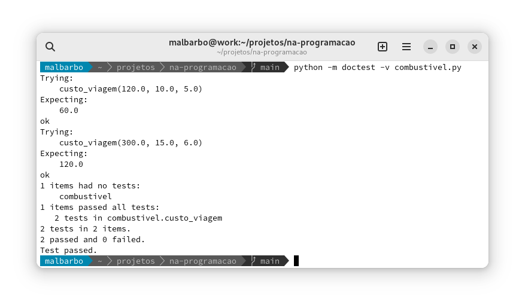

# Introdução

O André viaja muito. Sempre antes de fazer uma viagem ele calcula o quanto ele irá gastar com combustível. Ele determina a distância que ele irá percorrer na viagem, o preço do litro do combustível e consulta as suas anotações para ver o consumo do carro, isto é, a quantidade de quilômetros que o carro anda com um litro de combustível e então faz o cálculo do custo. O André acha um pouco chato fazer os cálculos na mão, então ele pediu para você escrever um programa que faça os cálculos para ele. \pause

Como projetar um programa que atenda a necessidade do André? \pause

Seguindo um processo, uma sequência de etapas.


# Introdução

Projetar programas que funcionem corretamente e sejam bem escritos é um desafio, seguir um processo é uma ferramenta indispensável nesse processo. \pause

No início, para problemas simples, o processo poderá parecer muito custoso, mas vamos apreciar a sua utilidade conforme progredimos.


# Projeto de funções

O processo que vamos seguir está dividido em 6 etapas: \pause

- Análise
- Definição dos tipos de dados
- Especificação
- Implementação
- Verificação
- Revisão


# Objetivos

Cada etapa tem um objetivo \pause

- Análise: \pause identificar o problema a ser resolvido \pause
- Definição dos tipos de dados: \pause identificar e definir como as informações serão representadas \pause
- Especificação: \pause especificar com precisão o que a função deve fazer \pause
- Implementação: \pause implementar a função de acordo com a especificação \pause
- Verificação: \pause verificar se a implementação está de acordo com a especificação \pause
- Revisão: \pause identificar e fazer melhorias


# Projeto de funções

Ao final de cada etapa produzimos resultados que são utilizados nas etapas posteriores, então devemos tentar seguir as etapas em ordem. \pause

No entanto, em algumas situações, pode ser necessário mudar a ordem. \pause

- Estamos na implementação e encontramos uma nova condição e devemos voltar e alterar a especificação. \pause

- Não estamos conseguindo entender o problema (análise) e então fazemos alguns exemplos (especificação) para nos ajudar. \pause

Mas devemos evitar fazer a implementação diretamente!


# Projeto de programas

Mas esse processe serve para projetar funções, como projetamos programas? \pause

Um programa é composto de várias funções, então temos que decompor o programa em funções e aplicar o processo para projetar cada função. \pause

Vamos treinar com problemas simples, de uma função, depois vamos utilizar o processo em problemas mais elaborados. \pause

Vamos iniciar resolvendo o problema do André!


# Análise

<div class="columns">
<div class="column" width="48%">
O André viaja muito. Sempre antes de fazer uma viagem ele calcula o quanto ele irá gastar com combustível. Ele determina a distância que ele irá percorrer na viagem, o preço do litro do combustível e consulta as suas anotações para ver o consumo do carro, isto é, a quantidade de quilômetros que o carro anda com um litro de combustível e então faz o cálculo do custo. O André acha um pouco chato fazer os cálculos na mão, então ele pediu para você escrever um programa que faça os cálculos para ele. \pause
</div>
<div class="column" width="48%">
**Objetivo**: identificar o problema a ser resolvido. \pause

- Quais informações são relevantes e quais podem ser descartadas?
- Existe alguma omissão?
- Existe alguma ambiguidade?
- Quais conhecimentos do domínio do problema são necessários? \pause

**Resultado** \pause

Calcular o custo em reais para percorrer uma determinada distância levando em consideração o desempenho do carro e o preço do litro do combustível.

</div>
</div>


# Definição dos tipos de dados

<div class="columns">
<div class="column" width="48%">
**Análise**

Calcular o custo em reais para percorrer uma determinada distância levando em consideração o desempenho do carro e o preço do litro do combustível. \pause
</div>
<div class="column" width="48%">
**Objetivo**: identificar e definir como as informações serão representadas. \pause

- Quais são as informações envolvidas no problema? \pause

- Como as informações serão representadas? \pause

**Resultado** \pause

As informações são a distância em Km, rendimento em Km/l, preço em R\$/l e o custo da viagem em R\$.

Todos os valores serão representados por números positivos.
</div>
</div>


# Especificação

<div class="columns">
<div class="column" width="48%">
**Análise**

Calcular o custo em reais para percorrer uma determinada distância levando em consideração o desempenho do carro e o preço do litro do combustível.

**Tipos de dados**

As informações são a distância em Km, rendimento em Km/l, preço em R\$/l e o custo da viagem em R\$.

Todos os valores serão representados por números positivos.
\pause
</div>
<div class="column" width="48%">
**Objetivo**: especificar com mais precisão e com exemplos o que o programa deve fazer. \pause

- Assinatura da função (nome, tipo das entradas e saídas)

- Propósito da função

- Exemplos de entrada e saída
</div>
</div>


# Especificação

**Assinatura** \pause

\footnotesize

```python
def custo_viagem(distancia: float, rendimento: float, preco: float) -> float:
    return 0.0
```

\pause

Note que colocamos o `return`{.python} com um valor padrão para que a função fique bem formada.

\pause

\small

**Propósito da função** \pause

O propósito descreve **o quê** a função deve fazer (faz, depois de implementada). Devemos usar o nome dos parâmetros na descrição do propósito para que a relação da entrada e da saída fique clara.

\pause

\footnotesize

```python
def custo_viagem(distancia: float, rendimento: float, preco: float) -> float:
    '''
    Calcula o custo em reais para percorrer a *distancia* especificada
    considerando o *rendimento* do carro e o *preco* do litro do combustível.
    '''
    return 0.0
```


# Especificação

No propósito da função descrevemos **o quê** a função faz, e não **como** ela faz (que é a implementação - as vezes precisamos dizer como é feito, mas isso é raro). \pause

Número par \pause

- O quê: verifica se um número é par \pause
- Como: faz o resto da divisão do número por 2 e compara com 0; ou; faz a divisão inteira do número e multiplica por 2 e compara com o número


# Especificação

**Exemplos**

Ilustrar com exemplos de entrada e saída o funcionamento da função. \pause O primeiro objetivo dos exemplos é ajudar o projetista a entender melhor como a função deve funcionar e como ela pode ser implementada. \pause

<div class="columns">
<div class="column" width="48%">
Como escolher bons exemplos? \pause

- Usar valores de casos práticos para o problema \pause

- Considerar diversas situações, incluindo casos extremos \pause

</div>
<div class="column" width="48%">

\small

```python
>>> # (120.0 / 10.0) * 5.0
>>> custo_viagem(120.0, 10.0, 5.0)
60.0
```

\pause

```python
>>> # (300.0 / 15.0) * 6.0
>>> custo_viagem(300.0, 15.0, 6.0)
120.0

```
</div>
</div>

\pause

Note que podemos deixar como comentário a expressão utilizada para calcular a resposta.


# Especificação

Para saber se a especificação está boa, faça a seguinte pergunta: \pause

Outro desenvolvedor, que não tem acesso ao problema original e nem a análise, tem as informações necessárias na especificação para fazer uma implementação e verificação inicial? \pause

Se a resposta for sim, então a especificação está boa, senão ela está incompleta.


# Implementação

**Objetivo**: escrever o corpo da função para que ela faça o que está na especificação. \pause

\scriptsize

```python
def custo_viagem(distancia: float, rendimento: float, preco: float) -> float:
    '''
    Calcula o custo em reais para percorrer a *distancia* especificada
    considerando o *rendimento* do carro e o *preco* do litro do combustível.

    Exemplos
    >>> # (120.0 / 10.0) * 5.0
    >>> custo_viagem(120.0, 10.0, 5.0)
    60.0
    '''
```

\pause

\normalsize

Observando a especificação, em particular os **exemplos**, generalizamos a forma de calcular a resposta. \pause Nesse problema, só temos uma forma de resposta, então a generalização é direta. \pause


\scriptsize

```python
    return (distancia / rendimento) * preco
```


# Verificação

**Objetivo**: verificar se a implementação está de acordo com a especificação. \pause

Usamos os exemplos para fazer a **verificação**. \pause

No modo interativo, digitamos cada e exemplo e conferimos se a resposta é a esperada: \pause

\small

```python
>>> custo_viagem(120.0, 10.0, 5.0)
60.0
```

\pause

```python
>>> custo_viagem(300.0, 15.0, 6.0)
120.0
```

\pause

\normalsize

Ok, as respostas são as esperadas.


# Verificação

Se na verificação um exemplos produzir uma resposta diferente da esperada, onde está o erro? \pause

- No exemplo \pause
- No código da função \pause
- Em ambos \pause

Primeiro conferimos os exemplos, se algum estiver errado, corrigimos o exemplo e fazemos a **verificação novamente**. \pause

Se os exemplos estiverem corretos, então analisamos o corpo da função para tentar identificar e corrigir o erro. \pause Após a alteração do código, fazemos a **verificação novamente**.


# Revisão

**Objetivo**: alterar a organização do programa para que fique mais fácil de ser lido, entendido e alterado. \pause

Se modificarmos o código, precisamos fazer a **verificação novamente**!


# Melhorias

Alguma parte desse processo parece repetitiva? \pause

Sim, a verificação do exemplos. \pause

Ao invés de executarmos cada exemplo manualmente, vamos usar uma biblioteca que executa os exemplos e verifica se as saídas estão corretas automaticamente!


# Verificação automatizada

A biblioteca que vamos utilizar já vem com o Python e chama `doctest`. \pause

Para fazer a verificação dos exemplos em uma arquivo `a.py`, executamos no terminal de comandos:

```
$ python -m doctest -v a.py
```

\pause

Como o Python identifica os exemplos que devem ser executados? \pause

Ele procura trechos de comentários semelhantes a uma seção do modo interativo, por isso escrevemos os exemplos com `>>>`!


# Verificação automatizada

{width=13cm}


# Exemplo - Número de azulejos

Vamos fazer outro exemplo.


# Análise

<div class="columns">
<div class="column" width="42%">
Um construtor precisa calcular a quantidade de azulejos necessários pra azulejar uma determinada parede. Cada azulejo é quadrado e tem 20cm de lado. Ajude o construtor e defina uma função que receba como entrada o comprimento e a altura em metros de uma parede e calcule a quantidade de azulejos inteiros necessários para azulejar a parede. Considere que o construtor nunca perde um azulejo e que recortes de azulejos não são reaproveitados.
</div>
<div class="column" width="53%">
**Objetivo**: identificar o problema a ser resolvido. \pause

- Quais informações são relevantes e quais podem ser descartadas?
- Existe alguma omissão?
- Existe alguma ambiguidade?
- Quais conhecimentos do domínio do problema são necessários? \pause

**Resultado** \pause

Calcular o número de azulejos necessários para azulejar uma parede com determinado comprimento e altura. \pause Cada azulejo mede 0,2,0m x 0,2m. \pause Nenhum azulejo é perdido e recortes são descartados.
</div>
</div>


# Definição de tipos de dados

<div class="columns">
<div class="column" width="48%">
**Análise**

Calcular o número de azulejos necessários para azulejar uma parede com determinado comprimento e altura. Cada azulejo mede 0,2m x 0,2m. Nenhum azulejo é perdido e recortes são descartados.
</div>
<div class="column" width="48%">
**Objetivo**: identificar e definir como as informações serão representadas. \pause

- Quais são as informações envolvidas no problema?

- Como as informações serão representadas? \pause

**Resultado** \pause

O comprimento e a altura da parede são dados em metros e representados com números positivos.
</div>
</div>


# Especificação

<div class="columns">
<div class="column" width="48%">
**Análise**

Calcular o número de azulejos necessários para azulejar uma parede com determinado comprimento e altura. Cada azulejo mede 0,2m x 0,2m. Nenhum azulejo é perdido e recortes são descartados.

**Tipos de dados**

O comprimento e a altura da parede são dados em metros e representados com números positivos.

</div>
<div class="column" width="48%">
**Objetivo**: especificar com mais precisão e com exemplos o que o programa deve fazer. \pause

- Assinatura da função (nome, tipo das entradas e saídas)

- Propósito da função

- Exemplos de entrada e saída

</div>
</div>


# Especificação

\small

```python
def numero_azulejos(comprimento: float, altura: float) -> int:
    '''
    Calcula o número de azulejos de 0,2mx0,2m necessários para azulejar uma
    parede de tamanho *comprimento* x *altura* (em metros) considerando que
    nenhum azulejo é perdido e que recortes são descartados.
    '''
    return 0
```

\pause

Qual deve ser o resultado para `numero_azulejos(1.5, 2.3)`{.python}? \pause `96`{.python} (discutido em sala).


# Especificação

\footnotesize

```python
    >>> # math.ceil(1.5 / 0.2) * math.ceil(2.3 / 0.2)
    >>> numero_azulejos(1.5, 2.3)
    96

    >>> # math.ceil(2.0 / 0.2) * math.ceil(2.4 / 0.2)
    >>> numero_azulejos(2.0, 2.4)
    120

    >>> numero_azulejos(0.2, 0.2)
    1
    >>> numero_azulejos(0.3, 0.2)
    2
    >>> numero_azulejos(0.3, 0.3)
    4
    >>> numero_azulejos(0.4, 0.4)
    4
```


# Implementação, verificação e revisão

Implementação

\small

```python
import math

def numero_azulejos(comprimento: float, altura: float) -> int:
    return math.ceil(comprimeto / 0.2) * math.ceil(altura / 0.2)
```

\pause

\normalsize

Verificação \pause

```
6 passed and 0 failed.
```

\pause


Revisão \pause

O código está ok.


# Exemplo - massa tudo de ferro

O Jorge precisa saber a massa de diversos pequenos tubos de ferro mas está sem uma balança. No entanto, ele possui um paquímetro e pode medir com precisão o diâmetro interno e externo e a altura dos tubos, agora ele só precisa de um programa para fazer os cálculos. Algum voluntário? \pause

Alguma coisa parece complicada nesse exercício?


# Exemplo - massa tudo de ferro

Nesse exercício precisamos de conhecimento de um domínio (área), que talvez ainda não tenhamos, isso pode fazer o problema parecer mais difícil do que realmente é. \pause Mas então, como proceder nesses casos? \pause

Precisamos de uma pessoa (ou livros) que possam nos instruir sobre o conhecimento do domínio, geralmente os interessados no software podem indicar tais pessoas. \pause

O importante é entender que o desenvolvedor de software geralmente resolve o problema de outras pessoas, e esses problemas podem envolver conhecimentos que não temos e por isso precisamos estar dispostos a estudar e aprender o conhecimento de outras áreas. \pause

Vamos resolver esse problema, por onde começamos?


# Exemplo - massa tudo de ferro

\small

**Análise** \pause

- Calcular a massa de um tubo de ferro a partir das suas dimensões. \pause Como as dimensões de um tubo de ferro está relacionada com a massa do tubo? \pause

- Dimensões $\rightarrow$ Volume $\rightarrow$ Massa \pause

- Como determinamos o volume de um tubo de ferro a partir das suas dimensões? \pause

    $$\pi \times \left ( \left ( \frac{diametro\_externo}{2} \right ) ^2 - \left ( \frac{diametro\_interno}{2} \right ) ^2 \right ) \times altura$$ \pause

- Como obtemos a massa a partir do volume? \pause $volume \times densidade$. \pause

- Qual é a densidade do ferro? \pause 7874 $kg/m^3$.


# Exemplo - massa tudo de ferro

**Definição de tipos de dados** \pause

- Comprimento é um número positivo dado em metros.
- Massa é um número positivo dado em quilogramas.


# Exemplo - massa tudo de ferro

**Especificação**

\pause

\footnotesize

```python
def massa_tubo_ferro(diametro_externo: float, diametro_interno: float, altura: float) -> float:
    '''
    Calcula a massa de um tubo de ferro a partir das suas dimensões.

    Requer diametro_externo > diametro-interno.

    Exemplos
    >>> # 3.14 * ((0.05 / 2) ** 2 - (0.03 / 2) ** 2) * 0.1 * 7874
    >>> massa_tubo_ferro(0.05, 0.03, 0.1)
    0.9889744
    '''
```


# Exemplo - massa tudo de ferro

**Implementação** \pause

Direto a partir da especificação (do exemplo). \pause

\footnotesize

```python
def massa_tubo_ferro(diametro_externo: float, diametro_interno: float, altura: float) -> float:
    return 3.14 * ((diametro_externo / 2) ** 2 - (diametro_interno / 2) ** 2) * altura * 7874
```


# Exemplo - massa tudo de ferro

**Verificação** \pause

\small

```
Failed example:
    massa_tubo_ferro(0.05, 0.03, 0.1)
Expected:
    0.9889744
Got:
    0.9889744000000004
```


# Exemplo - massa tudo de ferro

Comparação de igualdade de números de ponto flutuante quase não dá certo! \pause Nesses casos, podemos arredondar o resultado. \pause

\small

```python
    >>> round(massa_tubo_ferro(0.05, 0.03, 0.1), 7)
    0.9889744
```


# Exemplo - massa tudo de ferro

**Revisão**

\footnotesize

```python
def massa_tubo_ferro(diametro_externo: float, diametro_interno: float, altura: float) -> float:
    return 3.14 * ((diametro_externo / 2) ** 2 - (diametro_interno / 2) ** 2) * altura * 7874
```

\normalsize

O que podemos melhorar? \pause

- Definir constantes para os número "mágicos" \pause

- Separar o cálculo em etapas


# Exemplo - massa tudo de ferro

\footnotesize

```python
PI: float = 3.14
DENSIDADE_FERRO: float = 7874

def massa_tubo_ferro(diametro_externo: float, diametro_interno: float, altura: float) -> float:
    area_externa = PI * (diametro_externo / 2) ** 2
    area_interna = PI * (diametro_interno / 2) ** 2
    volume = (area_externa - area_interna) * altura
    return volume * DENSIDADE_FERRO
```

\pause

\normalsize

Constantes são geralmente definidas fora das funções (escopo global) e nomeadas com letras maiúsculas.


# Exemplo - Ajuste número telefone

No período de 2015 à 2016 todos os números de telefones celulares no Brasil passaram a ter nove dígitos. Na época, os números de telefones que tinham apenas oito dígitos foram alterados adicionando-se o 9 na frete do número. Embora oficialmente todos os número de celulares tenham nove dígitos, na agenda de muitas pessoas ainda é comum encontrar números registrados com apenas oito dígitos. Projete uma função que adicione o nono dígito em um dado número de telefone celular caso ele ainda não tenha o nono dígito. Considere que os números de entrada são dados com o DDD entre parênteses e com um hífen separando os últimos quatro dígitos. Exemplos de entradas: (44) 9787-1241, (51) 95872-9989, (41) 8876-1562. A saída deve ter o mesmo formato, mas garantindo que o número do telefone tenha 9 dígitos.


# Exemplo - Ajuste número telefone

**Análise** \pause

Ajustar o número de um telefone adicionando 9 como o nono dígito se necessário.

\pause

**Definição de tipo de dados** \pause

O número de telefone é uma string no formato (XX) XXXX-XXXX ou (XX) XXXXX-XXXX, onde X pode ser qualquer dígito.

\pause

**Especificação** \pause

A seguir.


# Exemplo - Ajuste número telefone

\footnotesize

```python
def ajusta_numero(numero: str) -> str:
    '''
    Ajusta *numero* adicionando o 9 como nono dígito se necessário, ou seja, se
    *numero* tem apenas 8 dígitos (sem contar o DDD).

    Requer que numero esteja no formato (XX) XXXX-XXXX ou (XX) XXXXX-XXXX, onde
    X pode ser qualquer dígito.

    Exemplos
    >>> # não precisa de ajuste, a saída e a própria entrada
    >>> ajusta_numero('(51) 95872-9989')
    '(51) 95872-9989'
    >>> # '(44) 9787-1241'[:5] + '9' + '(44) 9787-1241'[5:]
    >>> ajusta_numero('(44) 9787-1241')
    '(44) 99787-1241'
    '''
    return numero
```


# Implementação

O que mudou na forma que calculamos a resposta dos exemplos desse projeto em relação aos exemplos dos projetos anteriores? \pause

Nos projetos anteriores a resposta tinha apenas uma forma. Nesse projeto existem duas formas de resposta: ou a resposta é a própria entrada ou fazemos algumas operações específicas. \pause

Como escolher entre uma forma de resposta e outra? \pause

Usando instrução de seleção! \pause Vamos continuar na próxima aula.
