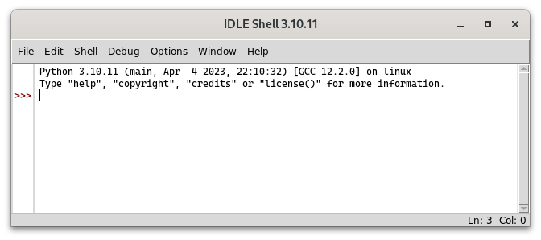
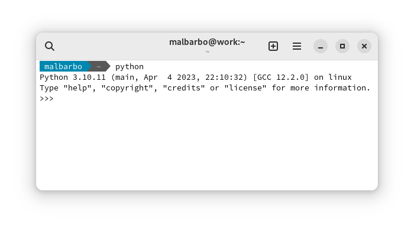

# Introdução

Até o momento nós estudamos alguns aspectos de

- Sistemas computacionais
- Algoritmos
- Linguagens de programação

\pause

Agora vamos ver as construções básicas da linguagem Python, para em seguida começarmos a estudar o processo de projeto de programas.


# Instalação

O Python é um software livre e pode ser baixado e instalado de <https://python.org>. \pause

Além do interpretador, a instalação padrão do Python vem com um ambiente de desenvolvimento e aprendizagem chamado IDLE. \pause

Ao iniciar o IDLE a janela a seguir é exibida \pause

{width=10cm}


# Janela de interações (REPL)

Utilizamos essa janela, chamada de janela de **interações** (ou REPL), para testar pequenos trechos de código. \pause

O símbolo `>>>` é chamado de _prompt_ e indica que o interpretador está pronto.


# Janela de interações (REPL)

As interações acontecem da seguinte forma

- Digitamos um trecho de código (_Read_)
- O código é avaliado (_Eval_)
- O resultado é mostrado na tela (_Print_)
- O processo se repete (_Loop_)

\pause

Exemplo de interação

```python
>>> 3 * 4
12
```


# Janela de interações (REPL)

O modo de interações também pode ser iniciado executado `python` no terminal de comandos. \pause

{width=10cm}


# Observação

Note que na janela de interações não criamos programas para seres utilizados por usuários, mas experimentamos aspectos do Python e testamos os nossos programas. \pause

Veremos posteriormente como criar programas completos. \pause

Agora vamos explorar o Python!


# Tipos de dados e operações pré-definidas

A primeira coisa que aprendemos em uma linguagem de programação é o tipo de valores e operações já disponíveis na linguagem.


# Números

Python tem diversos tipos de números, os dois principais que vamos utilizar são \pause

<div class="columns">
<div class="column" width="50%">

Inteiros (`int`{.python}) \pause

```python
>>> 102
102
>>> -18
-18
```

\pause

</div>
<div class="column" width="50%">

Ponto flutuante (`float`{.python}), representação aproximada de números reais \pause

```python
>>> 1.3
1.3
>>> 0.345
0.345
>>> # Notação científica
>>> # 1.23 * 10^2
>>> 1.23e2
123.0
```

</div>
</div>


# Operações básicas

Podemos usar as quatro operações aritméticas básicas com esses tipos numéricos e algumas outras operações, conforme veremos a seguir.


# Operações básicas

<div class="columns">
<div class="column" width="50%">

```python
>>> # Soma e subtração
>>> 4 + 2
6
>>> 4 + 2.0 - 5
1.0
```

\pause

```python
>>> # Multiplicação e divisão
>>> 3 * 5.0
15.0
>>> 7 / 2
3.5
```

\pause

```python
>>> # Divisão sempre produz float
>>> 8 / 4
2.0
```
</div>
<div class="column" width="50%">
\pause

```python
>>> # Piso da divisão
>>> 7 // 2
3
>>> 5 // 1.3
3.0
```

\pause

```python
>>> # Resto da divisão
>>> 14 % 3
2
>>> # float é uma aproximação
>>> # de números reais
>>> 5 % 1.3
1.0999999999999999
```

</div>
</div>


# Comentários

O símbolo `#`{.python} (cerquilha), é utilizado para indicar um comentário. O comentário incia em `#`{.python} e vai até o final da linha. Os comentários são ignorados pelo interpretador do Python, mas são utilizados para adicionar informações relevantes para os leitores do código.


# Exponenciação

```python
>>> # Exponenciação e radiciação
>>> 3 ** 4
81
>>> 2 ** 80
1208925819614629174706176
>>> 16 ** 0.5
4.0
```

\pause

```python
>>> # A exponenciação tem prioridade sobre a divisão
>>> 27 ** 1/3
9.0
>>> # Usamos parênteses para mudar a prioridade
>>> 27 ** (1/3)
3.0
```


# Prioridades

O Python utiliza a mesma precedência que estamos acostumados na matemática. Podemos usar o acrônimo PEMDAS para lembrar das prioridades

- **P**arênteses
- **E**xponenciação
- **M**ultiplicação e **D**ivisão
- **A**dição e **S**ubtração

Operadores com a mesma precedência são avaliados da esquerda para a direita, exceto a exponenciação, que é da direita para a esquerda.


# Exercício

Qual é o resultado de cada expressão a seguir?

\small

```python
>>> 15 // 7

>>> 15 % 7

>>> 12 // 27

>>> 12 % 27

>>> 3 * 4 - 5 / (8 // 3)

>>> 5 * 8 // 3 / 4 % 3

>>> 2 ** 2 ** 3 // 4 * 3

```


# Exercício

Qual é o resultado de cada expressão a seguir?

\small

```python
>>> 15 // 7
2
>>> 15 % 7
1
>>> 12 // 27
0
>>> 12 % 27
12
>>> 3 * 4 - 5 / (8 // 3)
9.5
>>> 5 * 8 // 3 / 4 % 3
0.25
>>> 2 ** 2 ** 3 // 4 * 3
192
```


# Conversão

```python
>>> # Arredondamento
>>> round(3.4)
3
>>> round(3.5)
4
>>> round(3.5134, 2)
3.51
```

\pause

```python
>>> # Conversão entre int e float
>>> int(7.6)
7
>>> int(-2.3)
-2
>>> float(4)
4.0
```


# Módulos

As operações que vimos até agora estão disponíveis automaticamente, outras operações estão disponíveis em módulos, que devem ser importados antes de poderem ser utilizados. \pause

O Python tem uma extensa biblioteca padrão, com muitos módulos, este é um dos motivos que a linguagem é bastante utilizada. A documentação da biblioteca padrão do Python está disponível em <https://docs.python.org/3/library/index.html>. \pause

Por hora, vamos ver apenas algumas funções do módulo [`math`](https://docs.python.org/3/library/math.html).


# Piso e teto

<div class="columns">
<div class="column" width="50%">

```python
>>> import math
>>> # Piso
>>> # maior inteiro <= ao número
>>> math.floor(4.2)
4
>>> math.floor(-2.3)
-3
```

\pause

</div>
<div class="column" width="50%">

```python
>>> # Teto
>>> # menor inteiro >= ao númeo
>>> math.ceil(4.2)
5
>>> math.ceil(-2.3)
-2
```

</div>
</div>


# Operações relacionais

Além das operações aritméticas, também podemos fazer operações relacionais com números. \pause

Que resposta você espera a comparação `3 > 4`{.python}? \pause E para `3 < 4`{.python}? \pause

Em Python a resposta da primeira comparação é `False`{.python} (falso) e da segunda `True`{.python} (verdadeiro). \pause

```python
>>> 3 > 4
False
>>> 3 < 4
True
```

\pause

Na computação os valores verdadeiro e falso são chamados de booleanos. Em Python, o tipo dos valores booleanos é `bool`{.python}. As operações relacionais produzem como resposta um valor booleano.


# Operações relacionais

<div class="columns">
<div class="column" width="50%">

```python
>>> # Maior e maior ou igual
>>> 4 > 2 + 2
False
>>> 4 >= 2 + 2
True
```

\pause

```python
>>> # Menor e menor ou igual
>>> 1 + 4 * 2 < 3 ** 2
False
>>> 1 + 4 * 2 <= 3 ** 2
True
```

\pause

</div>
<div class="column" width="50%">

```python
>>> # Igual
>>> 3 * 2 == 4 + 2 ** 2
False
>>> 9 == 4 + 2 ** 2
True
```

\pause

```python
>>> # Igual
>>> 3 * 2 != 4 + 2 ** 2
True
>>> 9 != 4 + 2 ** 2
False
```

</div>
</div>

\pause

Note que as operações relacionais tem prioridade menor do que as operações aritméticas.


# Operações lógicas

Podemos combinar operações relacionais.


# Variáveis

Uma **variável** é um nome para uma região da memória que é utilizada para armazenar valores. \pause

Cada variável tem um tipo, que determina o conjunto de valores que podem ser armazenados na memória associada com ela. \pause

Uma variável é primeiro declarada para depois poder ser usada. \pause Na declaração a variável também pode ser inicializada. \pause

A forma geral para declaração de variável é

```
Tipo nome [= valor inicial];
```

\pause

Alguns exemplos a seguir omitem a função `main` para não ficar repetitivo, mas na hora de testar o código, ele deve ser colocado dentro da função `main`.


# Variáveis

```cpp
int a = 10;
int b = 2 * a;
```

As variáveis `a` e `b` foram declaradas como inteiras (`int`{.cpp}), o que significa que apenas valores numéricos inteiros (no intervalo de -2.147.483.648 a 2.147.483.647) podem ser armazenados nessas variáveis. \pause

Além de números inteiros, também temos números de ponto flutuante (`double`{.cpp}), que são utilizadas para armazenar valores aproximados de números reais (15 dígitos significativos). \pause

```cpp
double c = 40.1;
```

\pause

Agora podemos ver a instrução de entrada!


# Entrada

A instrução de entrada, assim como a instrução de saída, está na biblioteca `iostream`. \pause Para ler um número de entrada fazemos \pause

<div class="columns">
<div class="column" width="48%">
```cpp
#include <iostream>

using namespace std;

int main()
{
    int a;
    cin >> a;
    cout << a << endl;
}
```

</div>

\pause

<div class="column" width="48%">
O que veremos na tela após a execução desse programa? \pause

O mesmo número repetido duas vezes, na primeira vez é a digitação do usuário e a segunda vez é pelo uso do `cout`. \pause

O que tem de errado com esse programa? \pause

O usuário não é informado sobre o que digitar e nem o que a saída significa.
</div>
</div>

# Entrada (arquivo `echo.cpp`)

```cpp
#include <iostream>

using namespace std;

int main()
{
    cout << "Digite um número: ";
    int a;
    cin >> a;
    cout << "O número que você digitou foi " << a << "." <<endl;
}
```


# Exercício

Agora já podemos fazer um programa completo! \pause

Escreva um programa que calcule a área de um retângulo.


# Exercício (arquivo `area-retangulo.cpp`)

\scriptsize

```cpp
#include <iostream>

using namespace std;

int main()
{
    cout << "Digite a medida da base: ";
    double base;
    cin >> base;

    cout << "Digite a medida da altura: ";
    double altura;
    cin >> altura;

    double area = base * altura;
    cout << "A area do retangulo e "
         << area
         << "."
         << endl;
}
```


# Erros

Vamos parar um pouco e pensar sobre erros. \pause

Durante a compilação de um programa, podem ocorrer dois tipos de erros: \pause

- Sintáticos
- Semânticos


# Erros sintáticos

Um erro sintático ocorre quando não seguimos as regras sintáticas da linguagem e o compilador não consegue "entender" a estrutura do programa.

<div class="columns">
<div class="column" width="30%">

```cpp
int x
cin >> x;
```

\pause

Qual é o erro nesse código? \pause

Falta `;` no final da sentença.

\pause

</div>
<div class="column" width="68%">

\small

Erro gerado pelo `g++`

```
x.cpp: In function ‘int main()’:
x.cpp:8:5: error: expected initializer before ‘cin’
    8 |     cin >> x;
      |     ^~~
```

\pause

Erro gerado pelo `clang++`

```
x.cpp:7:10: error: expected ';' at end of declaration
    int x
         ^
         ;
1 error generated.
```

</div>
</div>


# Erros sintáticos

<div class="columns">
<div class="column" width="30%">

```cpp
int x = (10 + 4;
```

\pause

Qual é o erro nesse código? \pause

Faltou fechar o parêntese.


\pause

</div>
<div class="column" width="68%">

\small

Erro gerado pelo `g++`

```
x.cpp: In function ‘int main()’:
x.cpp:7:20: error: expected ‘)’ before ‘;’ token
    7 |     int x = (10 + 4;
      |             ~      ^
      |                    )
```

\pause

Erro gerado pelo `clang++`

```
x.cpp:7:20: error: expected ')'
    int x = (10 + 4;
                   ^
x.cpp:7:13: note: to match this '('
    int x = (10 + 4;
            ^
1 error generated.
```

</div>
</div>


# Erros sintáticos

<div class="columns">
<div class="column" width="32%">

\footnotesize

```cpp
int nome com espaco = 10;
double namespace = 20.3;
```

\normalsize

Quais os erros nesse código? \pause

Usar nomes inválidos para variáveis. \pause

Um nome não pode ter espaços e nem ser uma palavra chave (como `namespace`{.cpp}).

\pause

</div>
<div class="column" width="66%">

\scriptsize

Erro gerado pelo `g++`

```
x.cpp: In function ‘int main()’:
x.cpp:7:14: error: expected initializer before ‘com’
    7 |     int nome com espaco = 10;
      |              ^~~
x.cpp:8:12: error: expected unqualified-id before ‘namespace’
    8 |     double namespace = 20.3;
      |            ^~~~~~~~~
```

\pause

Erro gerado pelo `clang++`

```
x.cpp:7:13: error: expected ';' at end of declaration
    int nome com espaco = 10;
            ^
            ;
x.cpp:8:12: error: expected unqualified-id
    double namespace = 20.3;
           ^
```

</div>
</div>


# Erros semânticos

Um erro semântico ocorre quando o compilador não "consegue" atribuir um significado para uma construção. \pause


```cpp
int a = 10 + "3";
```

Qual é o erro nesse código? \pause Usar operandos de tipos inválidos para uma operação.

\pause

Erro gerado pelo `g++`

\scriptsize

```
x.cpp: In function ‘int main()’:
x.cpp:7:16: error: invalid operands of types ‘int’ and ‘const char [2]’ to binary ‘operator*’
    7 |     int a = 10 * "3";
      |             ~~ ^ ~~~
      |             |    |
      |             int  const char [2]
```


# Erros semânticos

```cpp
int a = 10.6;
```

\pause

Qual o erro nesse código? \pause Por padrão, esta construção é válida e não gera erro! \pause

Nesse caso, apesar de ir contra a nossa intuição, o compilador atribui um significado para a construção, que é armazenar apenas a parte inteira de `10.6`{.cpp} em `a`. \pause

Às vezes o comportamento da linguagem não está de acordo com a nossa intuição, por isso precisamos conhecer com precisão a semântica da linguagem!


# Erros semânticos

Algumas construções que podem ser propensas a erros são aceitas por padrão pelos compiladores do C++. \pause Como programadores iniciantes, é bom termos um compilador mais "exigente", que nos ajude a identificar essas construções. \pause

Então, para compilarmos os nossos programas, vamos utilizar as opções `-Wall -Wextra -Wconversion -Werror`, que faz o compilador apontar como erro mais construções que não são muito claras.


# Erros semânticos

```cpp
int main()
{
    int a = 10.6;
}
```

Compilando o programa acima com o comando

```
g++ -Wall -Wextra -Wconversion -Werror arquivo.cpp
```

Produz a seguinte mensagem de erro

\scriptsize

```
x.cpp: In function ‘int main()’:
x.cpp:7:13: error: conversion from ‘double’ to ‘int’ changes value from ‘1.06e+1’ to ‘10’
    7 |     int a = 10.6;
      |             ^~~~
```


# Erros de execução

Se um programa foi compilado corretamente, isto é, não tem erros de sintaxe ou semântica, significa que ele não tem erros? \pause Não! \pause Erros podem ocorrer durante a execução do programa. \pause

Um erro de execução pode fazer o programa \pause

- Ser interrompido e exibir uma mensagem de erro (crashar) \pause
- Entrar em um laço infinito e nunca terminar (travar) \pause
- Continuar a execução e produzir a resposta errada


# Erros de execução

No programa que calcula a área do retângulo, o que acontece se o usuário digitar um número muito grande ou digitar algo que não é um número? \pause O programa executa até o final mas produz uma resposta incorreta. \pause

Como garantir que um programa não terá erros em tempo de execução? \pause Veremos isso ao longo da disciplina.


# Construções

Vamos voltar para o programa que calcula a área de um retângulo. \pause

<div class="columns">
<div class="column" width="50%">
\footnotesize
```cpp
#include <iostream>
using namespace std;
int main() {
    cout << "Digite a medida da base: ";
    double base;
    cin >> base;

    cout << "Digite a medida da altura: ";
    double altura;
    cin >> altura;

    double area = base * altura;
    cout << "A area do retangulo e "
         << area  << "." << endl;
}
```
</div>
<div class="column" width="50%">
\pause
\small

Quais construções da linguagem usamos nesse programa? \pause

- Uso de biblioteca e namespace; \pause
- Comandos de entrada e saída; \pause
- Tipo de dado e variáveis numéricos; \pause
- Operações com números. \pause

O que precisamos para escrever programas mais interessantes? \pause

- Outras operações com números; \pause
- Outros tipos de dados e operações; \pause
- Maneira de criar e nomear novas operações;

</div>
</div>


# Outras operações com números

As quatro operações aritméticas podem ser usadas com número inteiros ou de ponto flutuante. \pause Se os dois operandos são `int`{.cpp}, então o resultado é `int`{.cpp}. \pause Se pelo menos um dos operandos é `double`{.cpp}, então o resultado é `double`{.cpp}.

# Outras operações com números

<div class="columns">
<div class="column" width="50%">
\small

```cpp
// Soma e subtração
10 + 3 - 20.5; // -7.5
// Multiplicação
13 * 3; // 39
// Divisão "real"
21 / 3.0; // 7.0
21 / 8.0; // 2.625
// Divisão inteira
21 / 3; // 7;
21 / 8; // 2;
// Menos e mais unário
int a = 10;
-a; // -10;
+a; // +10;
```
\pause

</div>
<div class="column" width="50%">
Para números inteiros, também temos a operação de módulo (resto da divisão) \pause

```cpp
21 % 3; // 0
21 % 8; // 5
```
</div>
</div>


# Outras operações com números

Outras operações estão disponíveis na biblioteca [`cmath`](https://en.cppreference.com/w/cpp/header/cmath). \pause Alguns exemplos

\small

```cpp
// Função piso - maior inteiro que não é maior que o número
floor(1.0); // 1.0
floor(1.3); // 1.0
floor(1.5); // 1.0
floor(1.7); // 1.0
// Função teto - menor inteiro que não é menor que o número
ceil(1.3); // 2.0
ceil(1.5); // 2.0
ceil(1.7); // 2.0
ceil(2.0); // 2.0
// Função de aredondadmento - inteiro mais próximo do número
round(1.3); // 1.0
round(1.5); // 2.0
round(1.7); // 2.0
```

# Outras operações com números

```cpp
// Módulo (resto da divisão) para double
fmod(5.5, 2.0); // 1.5
fmod(15.0, 5.0); // 0.0
// Seno (o argumento é em radianos)
sin(3.14); // 0.00159265
// Raiz quadrada
sqrt(2.0); // 1.41421
// Exponencial
pow(2, 4); // 16
```

\pause

Podemos fazer muitas coisas com valores numéricos! \pause Mas também temos outros tipos de valores.


# Strings

Informações textuais podem ser representas por cadeias de caracteres. \pause

Usamos o tipo `string`, definido na biblioteca `string`, para armazenar cadeia de caracteres. \pause

Valores literais de strings são delimitados por `"`{.cpp}. \pause

```cpp
#include <string>

using namespace std;

int main()
{
    string nome = "Joao da Silva";
}
```


# Strings

Assim como podemos fazer operações com números, também podemos fazer operações com strings. \pause

```cpp
string nome = "Joao da Silva";

// Concatenação de strings
string junior = nome + " Filho"; // "Joao da Silva Filho"

// Extração de substring
// A partir da primeira letra, que está no índice 0,
// pegue 4 bytes (nesse caso, caracteres)
string primeiro_nome = nome.substr(0, 4); // "Joao"
```


# Strings

```cpp
string nome = "Joao da Silva";
```

Como extrair a substring `"Silva"` de `nome`? \pause `nome.substr(8, 5)`{.cpp}. \pause

Note que o segundo argumento para `substr` representa a quantidade de bytes (nesse caso, caracteres) a serem extraídos. \pause

O que acontece se especificarmos uma quantidade de bytes para extrair maior do que o "disponível", como por exemplo, `nome.substr(8, 7)`{.cpp}? \pause O método retorna apenas o que está disponível, nesse caso, `"Silva"`{.cpp}.


# Strings

Escreva um programa que leia um nome de uma pessoa e escreva uma mensagem de boas vindas para a pessoa.

\pause

Para ler uma string é necessário usar a função `getline` da biblioteca `string` da seguinte forma:

```cpp
string s;
getline(cin, s);
```


# Strings

```cpp
#include <iostream>
#include <string>

using namespace std;

int main()
{
    cout << "Nome: ";
    string nome;
    getline(cin, nome);

    cout << "Ola " << nome <<  ", seja bem vindo!" << endl;
}
```


# Booleanos

Qual resposta você daria para as seguintes expressões? \pause

`5 < 10`{.cpp} \pause, Verdadeiro. \pause

`9 + 2 > 7 * 2`{.cpp} \pause, Falso. \pause

O tipo `bool`{.cpp} (booleano) tem dois valores, verdadeiro (`true`{.cpp}) e falso (`false`{.cpp}). Assim como números e strings, os valores do tipo booleano podem ser armazenados e manipulados.


# Booleanos

```{.cpp}
bool a = true;
bool b = false;

string nome = "Jose";
// O operador == verifica se dois valores são iguais
bool chama_jose = nome == "Jose"; // true

// Operador >= (maior ou igual)
int idade = 17;
bool maior_de_idade = idade >= 18; // false
// Também podemos usar >, < e <=
```

# Booleanos

Os operadores de `==`{.cpp} (igual) e `!=`{.cpp} (diferente) também podem ser usados para números e outros tipos de dados. \pause

```{.cpp}
bool a = true;
bool b = false;
```

Qual o resultado de `a == b`{.cpp}? \pause O resultado é `false`{.cpp} pois o valor armazenado em `a`{.cpp} não é igual ao valor armazenado em `b`{.cpp}. \pause

Qual o resultado de `a != b`{.cpp}? \pause O resultado é `true`{.cpp} pois o valor armazenado em `a`{.cpp} é diferente do valor armazenado em `b`{.cpp}.


# Booleanos

Três operações são comuns com valores booleanos: \pause

- Negação \pause
- E lógico (conjunção) \pause
- Ou lógico (disjunção)


# Booleanos - Negação

Em C++ o símbolo da operação de negação é `!`{.cpp}. \pause

Qual o valor da expressão `4 < 5`{.cpp}? \pause `true`{.cpp}. \pause E da expressão `!(4 < 5)`{.cpp}? \pause `false`{.cpp}. \pause

Qual o valor da expressão `2 == 1 + 2`{.cpp}? \pause `false`{.cpp}. \pause E da expressão `!(2 == 1 + 2)`{.cpp}? \pause `true`{.cpp}.  \pause

Tabela verdade

a        | !a
---------|---------
 `false` | `true`
 `true`  | `false`


# Booleanos - Conjunção

Em C++ o símbolo da operação de conjunção é `&&`{.cpp} \pause


Tabela verdade

a        |  b      | a && b
---------|---------|---------
 `false` | `false` | `false`
 `false` | `true ` | `false`
 `true`  | `false` | `false`
 `true`  | `true`  | `true`


# Booleanos - Disjunção

Em C++ o símbolo da operação de disjunção é `||`{.cpp} \pause


Tabela verdade

a        |  b      | a && b
---------|---------|---------
 `false` | `false` | `false`
 `false` | `true ` | `true`
 `true`  | `false` | `true`
 `true`  | `true`  | `true`


# Booleanos

Em uma determinada cidade o transporte público é gratuito para crianças menores de 10 anos, adultos a partir de 60 anos e professores a partir de 50 anos. Escreva um programa que leia a idade de uma pessoa e se ela é professor e indique se essa pessoa pode usar o transporte público de forma gratuita. \pause

Em C++ na entrada e saída de valores booleanos `0`{.cpp} é usado para indicar `false`{.cpp} e `1`{.cpp} é usado para indicar `true`{.cpp}.


# Booleanos

\scriptsize

```cpp
#include <iostream>

using namespace std;

int main()
{
    cout << "Idade: ";
    int idade;
    cin >> idade;

    cout << "E professor? ";
    bool eh_professor;
    cin >> eh_professor;

    // Note que && tem priodade sobre ||
    bool livre = idade < 10 || idade >= 60 || idade >= 50 && eh_professor;

    cout << "Pode usar o transporte publico de forma gratuita? " << livre << endl;
}
```


# Combinado dados de tipo diferente

Podemos usar tipos diferentes na mesma expressão. \pause

```cpp
string texto = "1023"

// texto.length() produz a quantidade de bytes em texto
bool tem_4_caracteres = texto.length() == 4; // true

// stoi converte uma string que representa um número inteiro
// em um número inteiro
int x = stoi(texto) + 10; // 1033

// to_string converte um número para uma string
string r = texto + to_string(x); // "10231033"
```


# Novos tipos de expressões

Inicialmente as expressões (cálculos) dos nossos programas usavam apenas operadores matemáticos. \pause

- `30 * 2 + a`{.cpp} \pause

Nos últimos exemplos vimos que as expressões podem conter outros tipos de construções: as chamadas de funções e métodos.\pause

<div class="columns">
<div class="column" width="50%">
Chamada de funções \pause

- `sin(3.14)`{.cpp}
- `stoi("123")`{.cpp}

\pause
</div>
<div class="column" width="50%">
Chamada de métodos \pause

- `texto.length()`{.cpp}
- `nome.substr(0, 4)`{.cpp}
</div>
</div>


# Novos tipos de expressões

Embora a forma de utilizar operadores, funções e métodos seja diferente, o propósito dessas construções é o mesmo: computar valores de saída a partir de valores de entrada.


# Novos tipos de expressões

<div class="columns">
<div class="column" width="35%">
{width=4.8cm}
\pause
</div>
<div class="column" width="63%">
\small
Se o propósito é o mesmo, por que não usar a mesma forma? \pause

Por conveniência! \pause Por exemplo, se não tivéssemos a forma de operadores e apenas a forma de chamada de funções, então deveríamos escrever `+(*(30, 2), a)` ao invés de `30 * 2 + a`, o que seria inconveniente. \pause

Se não tivéssemos a forma de chamada de método, então deveríamos escrever `substr(nome, 0, 5)` ao invés de `nome.substr(0, 5)`, o que parece ok! Mas a questão é que chamadas de métodos são mais flexíveis do que chamada de funções, mas essa flexibilidade não será importante nessa disciplina e por isso não vamos discutir esse aspecto. Para nós, basta sabermos que algumas operações são chamadas como métodos.
</div>
</div>


# Criar e nomear novas operações

Vimos que para escrever programas mais interessantes vamos precisar de:

- Outras operações com números; \pause
- Outros tipos de dados e operações; \pause
- Maneira de criar e nomear novas operações; \pause Ou seja, nós vamos criar as nossas próprias funções!


# Criação de funções

A forma geral para definição de funções é \pause

\small

```cpp
TipoSaida nome_da_funcao(TipoEntrada1 entrada1, TipoEntrada2 entrada2, ...)
{
    return saida_da_funcao;
}
```

\pause

\normalsize

Baseado no programa que calcula a área de um retângulo, vamos criar uma função para calcular a área de um retângulo. (Solução desenvolvida em sala)


# Criação de funções

\small

```cpp
// Calcula a área do retângulo com a base b e a altura a.
// 10.0 5.0 -> 50.0
// 2.0 3.0 -> 6.0
double area_retangulo(double b, double a) {
    return b * a;
}

int main()
{
    // entrada omitida para economizar espaço no slide
    double area = area_retangulo(base, altura);
    // saída omitida para economizar espaço no slide
}
```


# Exercício

Projete um programa que a partir de um tempo especificado em número de horas, minutos e segundos, calcule o total de segundos do tempo.

\pause

Projeto feito em sala.


# Exercício

```cpp
// As h, m, s serão representados por inteiros positivos

// Calcula o total de segundos do tempo com h horas,
// m minutos e s segundos.
// Exemplos
// h=0 m=0 s=4 -> 4 + 0 * 60 + 0 * 3600 -> 4
// h=0 m=10 s=5 -> 5 + 10 * 60 + 0 * 3600 -> 605
// h=3 m=2 s=25 -> 25 + 2 * 60 + 3 * 3600 -> 10945
int total_segundos(int h, int m, int s)
{
    return s + m * 60 + h * 3600;
}
```

# Referências

Referências

- [Tutorial C++ - W3 Schools](https://www.w3schools.com/cpp/)

<!--
https://docs.microsoft.com/pt-br/cpp/?view=msvc-160

https://docs.microsoft.com/pt-br/cpp/cpp/cpp-language-reference?view=msvc-160

https://docs.microsoft.com/pt-br/cpp/cpp/welcome-back-to-cpp-modern-cpp

https://devdocs.io/

https://www.cplusplus.com

https://cppreference.com
!-->
