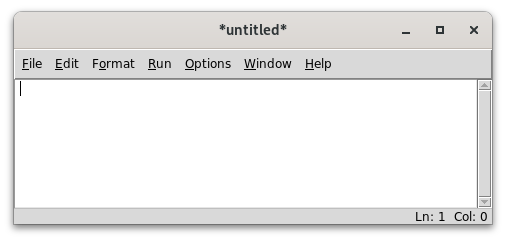
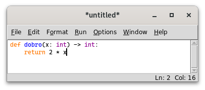
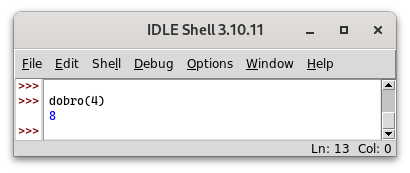
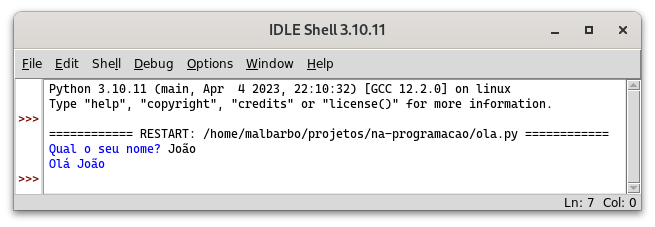
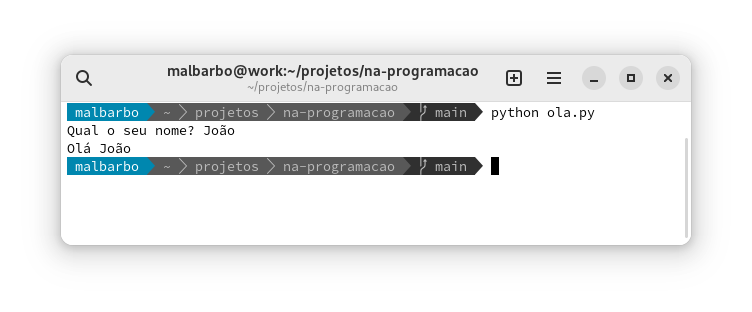
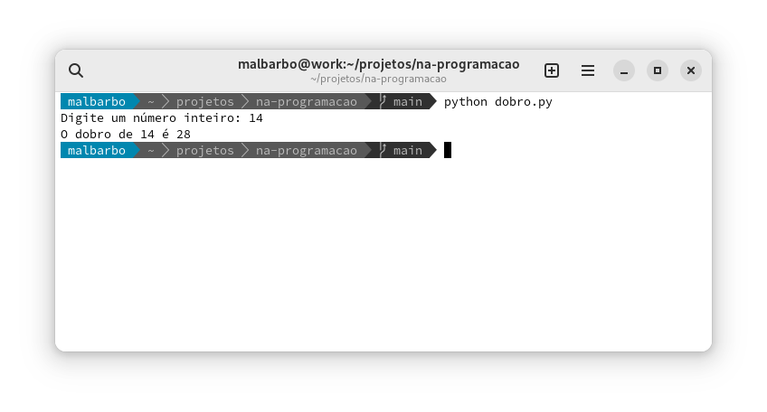

# Introdução

Até o momento nós estudamos alguns aspectos de

- Sistemas computacionais
- Algoritmos
- Linguagens de programação

\pause

Agora vamos ver as construções básicas da linguagem Python, para em seguida começarmos a estudar o processo de projeto de programas.


# Instalação

O Python é um software livre e pode ser baixado e instalado de <https://python.org>. \pause

Além do interpretador, a instalação padrão do Python vem com um ambiente de desenvolvimento e aprendizagem chamado IDLE. \pause

Ao iniciar o IDLE a janela a seguir é exibida \pause

{width=10cm}


# Janela de interações (REPL)

Utilizamos essa janela, chamada de janela de **interações** (ou REPL), para testar pequenos trechos de código. \pause

O símbolo `>>>` é chamado de _prompt_ e indica que o interpretador está pronto.


# Janela de interações (REPL)

As interações acontecem da seguinte forma

- Digitamos um trecho de código (_Read_)
- O código é avaliado (_Eval_)
- O resultado é mostrado na tela (_Print_)
- O processo se repete (_Loop_)

\pause

Exemplo de interação

```python
>>> 3 * 4
12
```


# Janela de interações (REPL)

O modo de interações também pode ser iniciado executado `python` no terminal de comandos. \pause

{width=10cm}


# Observação

Note que na janela de interações não criamos programas para seres utilizados por usuários, mas experimentamos aspectos do Python e testamos os nossos programas. \pause

Veremos posteriormente como criar programas completos. \pause

Agora vamos explorar o Python!


# Tipos de dados e operações pré-definidas

A primeira coisa que aprendemos de uma linguagem de programação são os tipos de valores (tipos de dados) e operações já disponíveis na linguagem. \pause

Os primeiros computadores foram criados para fazerem cálculos matemáticos, então vamos começar com isso.


# Números

Python tem diversos tipos de números, os dois principais que vamos utilizar são \pause

<div class="columns">
<div class="column" width="50%">

Inteiros (`int`{.python}) \pause

```python
>>> 102
102
>>> -18
-18
```

\pause

</div>
<div class="column" width="50%">

Ponto flutuante (`float`{.python}), representação aproximada de números reais \pause

```python
>>> 1.3
1.3
>>> 0.345
0.345
>>> # Notação científica
>>> # 1.23 * 10^2
>>> 1.23e2
123.0
```

</div>
</div>


# Operações básicas

Podemos usar as quatro operações aritméticas básicas com esses tipos numéricos e algumas outras operações, conforme veremos a seguir.


# Operações básicas

<div class="columns">
<div class="column" width="50%">

```python
>>> # Soma e subtração
>>> 4 + 2
6
>>> 4 + 2.0 - 5
1.0
```

\pause

```python
>>> # Multiplicação e divisão
>>> 3 * 5.0
15.0
>>> 7 / 2
3.5
```

\pause

```python
>>> # Divisão sempre produz float
>>> 8 / 4
2.0
```
</div>
<div class="column" width="50%">
\pause

```python
>>> # Piso da divisão
>>> 7 // 2
3
>>> 5 // 1.3
3.0
```

\pause

```python
>>> # Resto da divisão
>>> 14 % 3
2
>>> # float é uma aproximação
>>> # de números reais
>>> 5 % 1.3
1.0999999999999999
```

</div>
</div>


# Comentários

O símbolo `#`{.python} (cerquilha), é utilizado para indicar um comentário. O comentário incia em `#`{.python} e vai até o final da linha. Os comentários são ignorados pelo interpretador do Python, mas são utilizados para adicionar informações relevantes para os leitores do código.


# Exponenciação

```python
>>> # Exponenciação e radiciação
>>> 3 ** 4
81
>>> 2 ** 80
1208925819614629174706176
>>> 16 ** 0.5
4.0
```

\pause

```python
>>> # A exponenciação tem prioridade sobre a divisão
>>> 27 ** 1/3
9.0
>>> # Usamos parênteses para mudar a prioridade
>>> 27 ** (1/3)
3.0
```


# Prioridades

O Python utiliza a mesma precedência que estamos acostumados na matemática. Podemos usar o acrônimo PEMDAS para lembrar das prioridades

- **P**arênteses
- **E**xponenciação
- **M**ultiplicação e **D**ivisão
- **A**dição e **S**ubtração

Operadores com a mesma precedência são avaliados da esquerda para a direita, exceto a exponenciação, que é da direita para a esquerda.


# Exercício

Qual é o resultado de cada expressão a seguir?

\small

```python
>>> 15 // 7

>>> 15 % 7

>>> 12 // 27

>>> 12 % 27

>>> 3 * 4 - 5 / (8 // 3)

>>> 5 * 8 // 3 / 4 % 3

>>> 2 ** 2 ** 3 // 4 * 3

```


# Exercício

Qual é o resultado de cada expressão a seguir?

\small

```python
>>> 15 // 7
2
>>> 15 % 7
1
>>> 12 // 27
0
>>> 12 % 27
12
>>> 3 * 4 - 5 / (8 // 3)
9.5
>>> 5 * 8 // 3 / 4 % 3
0.25
>>> 2 ** 2 ** 3 // 4 * 3
192
```


# Conversão

<div class="columns">
<div class="column" width="50%">

```python
>>> # Arredondamento
>>> round(3.4)
3
>>> round(3.5)
4
>>> round(3.5134, 2)
3.51
```

\pause

</div>
<div class="column" width="50%">

```python
>>> # Conversão entre int e float
>>> int(7.6)
7
>>> int(-2.3)
-2
>>> float(4)
4.0
```

</div>
</div>


# Módulos

As operações que vimos até agora estão disponíveis automaticamente, outras operações estão disponíveis em módulos, que devem ser importados antes de poderem ser utilizados. \pause

O Python tem uma [extensa](https://xkcd.com/353/) biblioteca padrão, com muitos módulos, este é um dos motivos que a linguagem é bastante utilizada. A documentação da biblioteca padrão do Python está disponível em <https://docs.python.org/3/library/index.html>. \pause

Por hora, vamos ver apenas algumas funções do módulo [`math`](https://docs.python.org/3/library/math.html).


# Piso e teto

<div class="columns">
<div class="column" width="50%">

```python
>>> import math
>>> # Piso
>>> # maior inteiro <= ao número
>>> math.floor(4.2)
4
>>> math.floor(-2.3)
-3
```

\pause

</div>
<div class="column" width="50%">

```python
>>> # Teto
>>> # menor inteiro >= ao númeo
>>> math.ceil(4.2)
5
>>> math.ceil(-2.3)
-2
```

</div>
</div>


# Cadeia de caracteres

Outro tipo de dado pré-definido em Python é a cadeia de caracteres (`str`{.python}) -- _string_ em inglês. \pause

Geralmente usamos strings para armazenar informações simbólicas, como por exemplo palavras e textos. \pause

Uma string em Python é escrita entre apóstrofo ou aspas \pause

```python
>>> 'casa'
'casa'
>>> "gota d'agua"
"gota d'agua"
>>> "mesa"
'mesa'
```


# Operações com strings

Assim como existem operações pré-definidas para números, também existem operações pré-definidas para strings. \pause

<div class="columns">
<div class="column" width="50%">

```python
>>> # Concatenação
>>> 'casa' + ' da ' + 'sogra'
'casa da sogra'
```

\pause

```python
>>> # Repetição
>>> 'abc' * 3
'abcabcabc'
```

\pause

```python
>>> 'algum' * 0
''
>>> 'algum' * -4
''
```

\pause

</div>
<div class="column" width="50%">

```python
>>> # Quantidade de caracteres
>>> len('ciência da computação')
21
```

\pause

```python
>>> # Conversão maiúscula
>>> 'José'.upper() # ou str.upper('José')
'JOSÉ'
>>> # Conversão minúscula
>>> 'José'.lower() # ou str.lower('José')
'josé'
```

</div>
</div>


# Substrings

```python
>>> # Indexação de caractere
>>> # O primeiro caractere tem índice 0
>>> 'casa'[0] # ou str.__getitem__('casa', 0)
'c'
```

\pause

```python
>>> 'casa'[1]
'a'
```

\pause

```python
>>> # Acesso de índice fora do intervalo
>>> 'casa'[4]
Traceback (most recent call last):
  File "<stdin>", line 1, in <module>
IndexError: string index out of range
```


# Substrings

```python
>>> # Substring do início até 3 - 1
>>> 'veja isso'[:3] # ou str.__getitem__('veja isso', slice(None, 3))
'vej'
```

\pause

```python
>>> # Substring de 4 até o final
>>> 'veja isso'[4:] # ou str.__getitem__('veja isso', slice(4, None))
' isso'
```

\pause

```python
>>> # Substring de 2 até 6 - 1
>>> 'veja isso'[2:6] # ou str.__getitem__('veja isso', slice(7, 9))
'ja i'
```


# Conversão entre strings e números

<div class="columns">
<div class="column" width="50%">

```python
>>> # Conversão de int para str
>>> str(127)
'127'
>>> # Conversão de float para str
>>> str(4.1)
'4.1'
```

\pause

```python
>>> # Concatenação de str e int
>>> 'Idade: ' + str(19)
'Idade: 19'
```

\pause

</div>
<div class="column" width="50%">

```python
>>> # Conversão de str para int
>>> int('127')
127
```

\pause

```python
>>> # Conversão de str para float
>>> float('25')
25.0
>>> float('12.67')
12.67
```

</div>
</div>


# Formas de expressões

Inicialmente as expressões (cálculos) que vimos usavam apenas operadores matemáticos \pause

```python
30 * 2
```

\pause

Depois vimos que as expressões podem conter chamadas de funções \pause

```python
round(3.5)
```

\pause

e chamadas de métodos

```python
'José'.lower()
```

\pause

Por fim, vimos que strings podem ser indexadas \pause

```python
'veja isso'[2:6]
```


# Formas de expressões

Embora a forma de utilizar operadores, funções, métodos e indexação seja diferente, o propósito dessas construções é o mesmo: computar valores de saída a partir de valores de entrada.


# Formas de expressões

<div class="columns">
<div class="column" width="50%">
{width=6cm}
\pause
</div>
<div class="column" width="50%">
\small
Se o propósito é o mesmo, por que não usar a mesma forma? \pause

Por conveniência! \pause

Por exemplo, se não tivéssemos a forma de operadores e apenas a forma de chamada de funções, então deveríamos escrever

```python
from operator import add, mull
add(mul(30, 2), 3)
```

ao invés de `30 * 2 + 3`{.python}, o que seria inconveniente. \pause

Além da conveniência de escrita, a forma de chamada métodos e indexação tem outras vantagens, que não vamos discutir nessa disciplina.
</div>
</div>


# Exercício

Qual é o resultado de cada expressão a seguir?

\small

```python
>>> len('casa') * 'x'

>>> str(10) + 2 * '*' + str(2.0)

>>> 'Jose da Silva'[:4].upper()

>>> 'Jose da Silva'[8:].lower()

>>> str(int('12') * 100)[1:3]

>>> int(('1' * 3 + 3 * '2').upper()[2:4])

```


# Exercício

Qual é o resultado de cada expressão a seguir?

\small

```python
>>> len('casa') * 'x'
'xxxx'
>>> str(10) + 2 * '*' + str(2.0)
'10**2.0'
>>> 'Jose da Silva'[:4].upper()
'JOSE'
>>> 'Jose da Silva'[8:].lower()
'silva'
>>> str(int('12') * 100)[1:3]
'20'
>>> int(('1' * 3 + 3 * '2').upper()[2:4])
12
```


# Definindo novas funções

Além de podermos usar as funções pré-definidas no Python, também podemos definir as nossas próprias funções.

\pause

Apesar de ser possível definir uma nova função na janela de interações, nós vamos fazer isso na janela de edição de código. Isso nos permite salvar o código para uso/edição posterior.


# Definindo novas funções

Para abrir a janela de edição de código selecionamos o menu File $\rightarrow$ New File (crtl + n). \pause

{width=9cm}


# Definindo novas funções

Vamos criar uma função que calcula o dobro de um dado número. \pause

O que precisamos para definir essa função? \pause

- O nome da função (`dobro`) \pause
- O nome e tipo da entrada (`x: int`{.python}) \pause
- O tipo da saída (`int`{.python}) \pause
- As instruções que calculam o valor da saída a partir da entrada (`2 * x`{.python}) \pause

Com essas informações, definimos a função usando a forma

```python
def nome(entrada1: tipo, entrada2: tipo, ...) -> tipo:
    return exp
```


# Definindo novas funções

<div class="columns">
<div class="column" width="50%">
Escrevemos o código da função na janela de edição de código e salvamos o arquivo (File $\rightarrow$ Save - crtl\ +\ s).

{width=6.5cm}

\pause
</div>
<div class="column" width="50%">

Para testar a função executamos o arquivo (Run $\rightarrow$ Run Module - F5) e chamamos a função na janela de interações. \pause

{width=6.5cm}
</div>
</div>


# Diferenças entre a janela de interações e a de edição de código

O que acontece se escrevermos o exemplo de execução da função `dobro` após a sua definição e executarmos o arquivo (Run Module)?

```python
def dobro(x: int) -> int:
    return 2 * x

dobro(4)
```

\pause

A função `dobro` será executada para o valor `4`{.python} mais nenhum resultado será exibido na tela. \pause

Por que na execução do exemplo na janela de interações o resultado é exibido e aqui não? \pause

Por que o modo de interação a exibição é feita automaticamente (o P -- _print_ -- de REPL) para facilitar a interação com o Python. \pause No arquivo de código, precisamos indicar explicitamente que queremos que o resultado seja exibido.


# Instrução de saída

A forma mais comum de exibir um valor em Python é utilizando a função `print`{.python}. \pause

```python
def dobro(x: int) -> int:
    return 2 * x

print(dobro(4))
```

\pause

Ao executar o código, o valor `8` será exibido na tela. \pause

Note que o `print`{.python} posiciona o cursor no início da próxima linha, dessa forma, a próxima informação começara a ser exibida no início da próxima linha.


# Instrução de saída

A função `print`{.python} pode ser utilizada com mais de um argumento e os argumentos podem ser de tipos diferentes \pause

```python
def dobro(x: int) -> int:
    return 2 * x

print('O dobro de 4 é:', dobro(4))
```

Saída

```
O dobro de 4 é: 8
```

\pause

Note que não colocamos espaço após `'é:'`{.python} na chamada do `print`{.python}, mas um espaço aparece na saída. Isto porque o `print`{.python} adiciona um espaço automaticamente entre cada argumento antes de exibir na tela.

# Instrução de saída

Esse comportamento do `print`{.python} pode ser indesejável em algumas situações, como por exemplo, se quiséssemos colocar um ponto final após o valor calculado do dobro. \pause Nesse caso, podemos instruir o `print`{.python} a não fazer a separação automática (especificando `sep=''`{.python}) e fazermos a separação manualmente \pause

```python
def dobro(x: int) -> int:
    return 2 * x

print('O dobro de 4 é: ', dobro(4), '.', sep='')
```


# Programas

Agora que aprendemos algumas das construções básicas do Python, podemos avançar e ver como fazer um programa completo. \pause

Para isso, vamos precisar de mais duas coisas \pause

- Instrução de entrada \pause
- Variáveis


<!--
# Operações relacionais

Além das operações aritméticas, também podemos fazer operações relacionais com números. \pause

Que resposta você espera a comparação `3 > 4`{.python}? \pause E para `3 < 4`{.python}? \pause

Em Python a resposta da primeira comparação é `False`{.python} (falso) e da segunda `True`{.python} (verdadeiro). \pause

```python
>>> 3 > 4
False
>>> 3 < 4
True
```

\pause

Na computação os valores verdadeiro e falso são chamados de booleanos. Em Python, o tipo dos valores booleanos é `bool`{.python}. As operações relacionais produzem como resposta um valor booleano.


# Operações relacionais

<div class="columns">
<div class="column" width="50%">

```python
>>> # Maior e maior ou igual
>>> 4 > 4
False
>>> 4 >= 4
True
```

\pause

```python
>>> # Menor e menor ou igual
>>> 6 < 6
False
>>> 6 <= 6
True
```

\pause

</div>
<div class="column" width="50%">

```python
>>> # Igual
>>> 5 == 
False
>>> 9 == 4 + 2 ** 2
True
```

\pause

```python
>>> # Igual
>>> 3 * 2 != 4 + 2 ** 2
True
>>> 9 != 4 + 2 ** 2
False
```

</div>
</div>

\pause

Note que as operações relacionais tem prioridade menor do que as operações aritméticas.


# Operações lógicas

Podemos combinar operações relacionais.

-->

# Variáveis

Uma **variável** é um nome para uma região da memória (célula) que é utilizada para armazenar valores. \pause

Cada variável tem um tipo, que determina o conjunto de valores que podem ser armazenados na memória associada com ela. \pause

Uma variável pode ser primeiro declarada e depois inicializa ou pode ser declarada e inicializada de uma vez só. \pause

A forma geral para declaração de variável é (o `valor inicial` é opcional)

```python
nome: tipo [= valor inicial]
```

# Variáveis

```python
>>> a: int = 10
>>> b: int = 2 * a
>>> b
20
```

\pause

As variáveis `a` e `b` foram declaradas com tipo `int`{.python} e inicializadas na declaração. A variável `a` foi inicializada com o valor `10`{.python} e a variável `b` com o valor `2 * a`{.python}. \pause

O símbolo `=` representa **atribuição**. Para executar uma atribuição o Python primeiro avalia a expressão do lado direito para obter um valor, e depois associa a memória que armazena esse valor com o nome da variável.


# Sequenciação de instruções

O Python executa as instruções de forma sequencial, uma linha após a outra, por isso, a ordem das instruções é importante. \pause

Qual o resultado da execução das instruções abaixo?

```python
>>> x: int = 2 * y
>>> y: int = 10
>>> x
?
```

\pause

Um erro de execução! Quando o Python avalia a expressão `2 * y`{.python} a variável `y` ainda não foi definida, então não é possível calcular o valor da expressão.


# Sequenciação de instruções

Qual o resultado de `b` no seguinte trecho de código?

```python
>>> a: int = 10
>>> b: int = 2 * a
>>> a = 30
>>> b
?
```

\pause

`20`{.python}. \pause O Python executar uma linha por vez, na primeira linha a variável `a` é criada referenciando uma célula de memória com o valor `10`{.python}. \pause Depois a expressão `2 * a`{.python} é avaliada com resultado `20`{.python} e a variável `b` é criada referenciado a célula de memória que armazena esse valor. \pause Depois a variável `a` é alterada, passando a referenciar a célula de memória com o valor `30`{.python}. \pause Por vim, o valor armazenado na célula de memória associada com `b`, que é `20`{.python}, é exibido.


# Instrução de entrada

A forma mais comum de ler um valor digitado pelo usuário em Python é utilizando a função `input`{.python}. \pause

A função `input`{.python} exibi uma mensagem e aguarda o usuário digitar a entrada e pressionar enter. Em seguida o valor digitado pelo usuário é retornado como uma string.


# Instrução de entrada

Se escrevermos o seguinte código em um arquivo `ola.py`,

```python
nome: str = input('Qual o seu nome?: ')
print('Olá', nome)
```

executarmos com F5, e fizermos a entrada do nome `João`, obtemos o seguinte resultado

{width=10cm}


# Instrução de entrada

Também podemos executar o programa no terminal de comando

{width=11cm}

Note que é preciso estar no diretório onde o arquivo está salvo (no caso `projetos/na-programacao/`) ou utilizar o caminho completo para o arquivo.


# Instrução de entrada vs modo interativo

Apesar de ser possível utilizar as funções de entrada e saída na janela de interações, isso não é muito comum, afinal, podemos executar diretamente as funções com os argumentos que queremos e ver o resultado automaticamente, não é necessário perguntar nada para o usuário! \pause

Por exemplo, se estamos testando a função `len`{.python}, ao invés de fazermos a entrada

```python
>>> palavra: str = input('Digite uma palavra: ')
Digite uma palavra: casa
>>> len(palavra)
4
```

podemos fazer diretamente

```python
>>> len('casa')
4
```


# Programa para calcular o dobro de um número

Agora já podemos criar um programa completo com entrada, processamento e saída! \pause

Vamos fazer um programa que utiliza a função `dobro` para fazer o processamento.


# Programa para calcular o dobro de um número

\small

```python
def dobro(x: int) -> int:
    return 2 * x

# Entrada
numero: int = int(input('Digite um número inteiro: '))

# Processamento
d: int = dobro(numero)

# Saída
print('O dobro de', numero, 'é', d)
```

\pause

\normalsize

Note que a função `input`{.python} produz como resultado uma string, como queremos um inteiro, usamos a função `int`{.python} para converter a entrada do usuário para um inteiro.


# Programa para calcular o dobro de um número




# Organizando o código

Apesar do programa funcionar corretamente, podemos melhorar a organização agrupando as instruções de entrada, processamento e saída em uma função, que convencionalmente chamaremos de `main`. \pause

Além disso, colocamos a função `main` no início do arquivo.


# Organizando o código

\small

```python
def main():
    # Entrada
    numero: int = int(input('Digite um número inteiro: '))

    # Processamento
    d: int = dobro(numero)

    # Saída
    print('O dobro de', numero, 'é', d)

def dobro(x: int) -> int:
    return 2 * x

main()
```


# Organizando o código

Note que precisamos chamar explicitamente a função `main` no final do arquivo. \pause

O que aconteceria se removêssemos a chamada da função `main` e executássemos o arquivo? \pause Nada, sem a chamada da função `main`, nenhuma instrução é executada.


# Execução passo a passo

Nós vimos anteriormente que o Python executa as instruções de forma sequencial, uma linha após a outra. Mas isso nem sempre é verdade, vamos ver como o Python executa o programa dobro.


# Execução passo a passo

<div class="columns">
<div class="column" width="50%">

\footnotesize

```{.python .number-lines}
def main():
    # Entrada
    numero: int = int(input('Número: '))

    # Processamento
    d: int = dobro(numero)

    # Saída
    print('O dobro de', numero, 'é', d)

def dobro(x: int) -> int:
    return 2 * x

main()
```
</div>
<div class="column" width="50%">
\pause
Em qual ordem as linhas do programa são executadas pelo Python? \pause

14, \pause e depois? \pause

3 (primeira linha de código da função `main`), \pause 6, \pause e depois? \pause

12 (primeira linha de código da função `dobro`), \pause e depois? \pause

6 (retorna com o resultado para onde `dobro` foi chamada), \pause 9, \pause e depois? \pause

14 (retorna para onde `main` foi chamada)
</div>
</div>


# Erros

Vamos parar um pouco e pensar sobre erros. \pause

Durante a compilação de um programa, podem ocorrer dois tipos de erros: \pause

- Sintáticos
- Semânticos


# Erros sintáticos

Um erro sintático ocorre quando não seguimos as regras sintáticas da linguagem e o interpretador não consegue "entender" a estrutura do programa.

<div class="columns">
<div class="column" width="30%">

```cpp
x: int = 2 + 4) * 6
```

\pause

Qual é o erro nesse código? \pause

Falta `(` na expressão.

\pause

</div>
<div class="column" width="68%">

</div>
</div>


# Erros sintáticos

<div class="columns">
<div class="column" width="32%">

\footnotesize

```cpp
nome com espaco: int = 10
def: float = 20.3
```

\normalsize

Quais os erros nesse código? \pause

Uso de nomes inválidos para variáveis. \pause

Um nome não pode ter espaços e nem ser uma palavra chave (como `def`{.def}).

\pause

</div>
<div class="column" width="66%">

</div>
</div>


# Erros semânticos

Um erro semântico ocorre quando o compilador não "consegue" atribuir um significado para uma construção. \pause


```python
a: int = 10 + "3"
```

Qual é o erro nesse código? \pause Usar operandos de tipos inválidos para uma operação.


# Erros semânticos

```cpp
a: int = 10.6;
```

\pause

Qual o erro nesse código? \pause Por padrão, esta construção é válida e não gera erro! \pause


# Erros de execução

Se um programa foi compilado corretamente, isto é, não tem erros de sintaxe ou semântica, significa que ele não tem erros? \pause Não! \pause Erros podem ocorrer durante a execução do programa. \pause

Um erro de execução pode fazer o programa \pause

- Ser interrompido e exibir uma mensagem de erro (crashar) \pause
- Entrar em um laço infinito e nunca terminar (travar) \pause
- Continuar a execução e produzir a resposta errada


# Erros de execução

No programa que calcula o dobro de um número, o que acontece se o usuário digitar um float ou algo que não é um número? \pause O programa é interrompido com um erro. \pause

Como garantir que um programa não terá erros em tempo de execução? \pause Veremos isso ao longo da disciplina.
