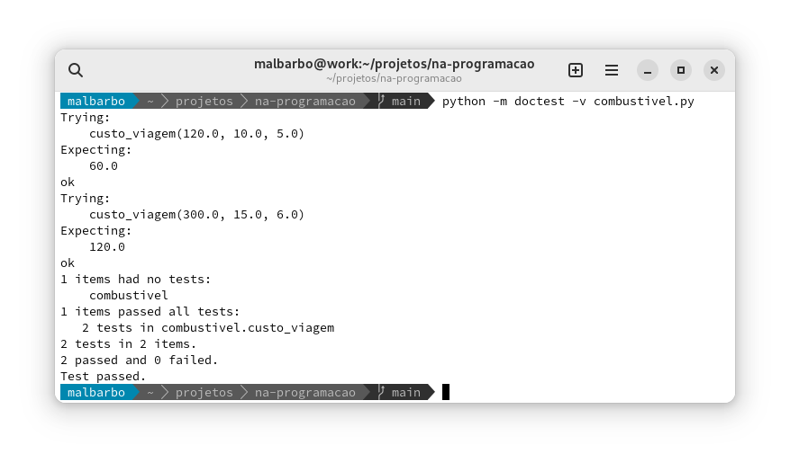

# Introdução

O André viaja muito. Sempre antes de fazer uma viagem ele calcula o quanto ele irá gastar com combustível. Ele determina a distância que ele irá percorrer na viagem, o preço do litro do combustível e consulta as suas anotações para ver o consumo do carro, isto é, a quantidade de quilômetros que o carro anda com um litro de combustível e então faz o cálculo do custo. O André acha um pouco chato fazer os cálculos na mão, então ele pediu para você escrever um programa que faça os cálculos para ele. \pause

Como projetar um programa que atenda a necessidade do André? \pause

Seguindo um processo, uma sequência de etapas.


# Introdução

Projetar programas que funcionem corretamente e sejam bem escritos é um desafio, seguir um processo é uma ferramenta indispensável nesse processo. \pause

No início, para problemas simples, o processo poderá parecer muito custoso, mas vamos apreciar a sua utilidade conforme progredimos.


# Projeto de funções

O processo que vamos seguir está dividido em 6 etapas: \pause

- Análise
- Definição dos tipos de dados
- Especificação
- Implementação
- Verificação
- Revisão


# Objetivos

Cada etapa tem um objetivo \pause

- Análise: \pause identificar o problema a ser resolvido \pause
- Definição dos tipos de dados: \pause identificar e definir como as informações serão representadas \pause
- Especificação: \pause especificar com precisão o que a função deve fazer \pause
- Implementação: \pause implementar a função de acordo com a especificação \pause
- Verificação: \pause verificar se a implementação está de acordo com a especificação \pause
- Revisão: \pause identificar e fazer melhorias


# Projeto de funções

Ao final de cada etapa produzimos resultados que serão utilizados nas etapas posteriores, então devemos tentar seguir as etapas em ordem. \pause No entanto, em algumas situações, pode ser necessário mudar a ordem. \pause

Por exemplo, às vezes estamos na implementação e encontramos uma nova condição e devemos
voltar e alterar a especificação. \pause Em outra situação não estamos conseguindo entender o problema (análise) e então fazemos alguns exemplos (especificação) para nos ajudar. \pause

Mas devemos evitar fazer a implementação diretamente!


# Projeto de programas

Mas esse processe serve para projetar funções, como projetamos programas? \pause

Um programa é composto de várias funções, então temos que decompor o programa em funções e aplicar o processo para projetar cada função. \pause

Vamos treinar com problemas simples, de uma função, depois vamos utilizar o processo em problemas mais elaborados. \pause

Vamos iniciar resolvendo o problema do André!


# Análise

<div class="columns">
<div class="column" width="48%">
O André viaja muito. Sempre antes de fazer uma viagem ele calcula o quanto ele irá gastar com combustível. Ele determina a distância que ele irá percorrer na viagem, o preço do litro do combustível e consulta as suas anotações para ver o consumo do carro, isto é, a quantidade de quilômetros que o carro anda com um litro de combustível e então faz o cálculo do custo. O André acha um pouco chato fazer os cálculos na mão, então ele pediu para você escrever um programa que faça os cálculos para ele. \pause
</div>
<div class="column" width="48%">
**Objetivo**: identificar o problema a ser resolvido. \pause

- Quais informações são relevantes e quais podem ser descartadas?
- Existe alguma omissão?
- Existe alguma ambiguidade?
- Quais conhecimentos do domínio do problema são necessários? \pause

**Resultado** \pause

Calcular o custo em reais para percorrer uma determinada distância levando em consideração o desempenho do carro e o preço do litro do combustível.

</div>
</div>


# Definição dos tipos de dados

<div class="columns">
<div class="column" width="48%">
**Análise**

Calcular o custo em reais para percorrer uma determinada distância levando em consideração o desempenho do carro e o preço do litro do combustível. \pause
</div>
<div class="column" width="48%">
**Objetivo**: identificar e definir como as informações serão representadas. \pause

- Quais são as informações envolvidas no problema? \pause

- Como as informações serão representadas? \pause

**Resultado** \pause

As informações são a distância em Km, rendimento em Km/l, preço em R\$/l e o custo da viagem em R\$.

Todos os valores serão representados por números positivos.
</div>
</div>


# Especificação

<div class="columns">
<div class="column" width="48%">
**Análise**

Calcular o custo em reais para percorrer uma determinada distância levando em consideração o desempenho do carro e o preço do litro do combustível.

**Tipos de dados**

As informações são a distância em Km, rendimento em Km/l, preço em R\$/l e o custo da viagem em R\$.

Todos os valores serão representados por números positivos.
\pause
</div>
<div class="column" width="48%">
**Objetivo**: especificar com mais precisão e com exemplos o que o programa deve fazer. \pause

- Assinatura da função (nome, tipo das entradas e saídas)

- Propósito da função

- Exemplos de entrada e saída
</div>
</div>


# Especificação

**Assinatura e propósito da função** \pause

O propósito descreve **o quê** a função faz (deve fazer). Devemos usar o nome dos parâmetros na descrição do propósito para que a relação da entrada e da saída fique clara.

\pause

\small

```python
def custo_viagem(distancia: float, rendimento: float, preco: float) -> float:
    '''
    Calcula o custo em reais para percorrer a *distancia* especificada
    considerando o *rendimento* do carro e o *preco* do litro do combustível.
    '''
    return 0.0
```


# Especificação

No propósito da função descrevemos **o quê** a função faz, e não **como** ela faz (que é a implementação - as vezes precisamos dizer como ela faz, mas isso é raro). \pause

Número par \pause

- O quê: verifica se um número é par \pause
- Como: faz o resto da divisão do número por 2 e compara com 0; ou; faz a divisão inteira do número e multiplica por 2 e compara com o número


# Especificação

**Exemplos**

Ilustrar com exemplos de entrada e saída o funcionamento da função, o que auxilia o programador a entender melhor como a função deve funcionar e como ela pode ser implementada. \pause

<div class="columns">
<div class="column" width="48%">
Como escolher bons exemplos? \pause

- Usar valores de casos práticos para o problema \pause

- Considerar diversas situações, incluindo casos extremos \pause

</div>
<div class="column" width="48%">

```python
>>> # (120.0 / 10.0) * 5.0
>>> custo_viagem(120.0, 10.0, 5.0)
60.0
```

\pause

```python
>>> # (300.0 / 15.0) * 6.0
>>> custo_viagem(300.0, 15.0, 6.0)
120.0
```

Note que podemos deixar como comentário a expressão utilizada para calcular a resposta.

</div>
</div>


# Especificação

Para saber se a especificação está boa, faça a segunda pergunta: \pause

Um outro programador, que não tem acesso ao problema original e nem a análise, tem as informações necessárias na especificação para fazer uma implementação e verificação inicial? \pause

Se a resposta for sim, então a especificação está boa, senão ela está incompleta.


# Implementação

**Objetivo**: escrever o corpo da função para que ela faça o que está na especificação. \pause

\scriptsize

```python
def custo_viagem(distancia: float, rendimento: float, preco: float) -> float:
    '''
    Calcula o custo em reais para percorrer a *distancia* especificada
    considerando o *rendimento* do carro e o *preco* do litro do combustível.

    Exemplos
    >>> # (120.0 / 10.0) * 5.0
    >>> custo_viagem(120.0, 10.0, 5.0)
    60.0
    >>> # outro exemplo omitido
    '''
    return 0.0
```

\pause

\normalsize

Baseado nos exemplos, generalizamos a forma de calcular a resposta. \pause

\scriptsize

```python
def custo_viagem(distancia: float, rendimento: float, preco: float) -> float:
    return (distancia / rendimento) * preco
```


# Verificação

**Objetivo**: verificar se a implementação está de acordo com a especificação. \pause

Usamos os exemplos para verificar se o programa funciona corretamente. \pause

Iniciamos o modo interativo, digitamos cada e exemplo e conferimos se a resposta é a esperada: \pause

\small

```python
>>> custo_viagem(120.0, 10.0, 5.0)
60.0
```

\pause

```python
>>> custo_viagem(300.0, 15.0, 6.0)
120.0
```


# Verificação

Se o programa produzir a resposta errada para algum exemplo, onde está o erro? \pause

- No exemplo \pause
- No código da função \pause
- Em ambos \pause

Primeiro conferimos os exemplos, se algum estiver errado, corrigimos o exemplo e fazemos a verificação novamente. \pause

Se os exemplos estiverem corretos, então analisamos o corpo da função para tentar identificar e corrigir o erro. \pause Após a alteração do código, fazemos a verificação novamente.


# Revisão

**Objetivo**: alterar a organização do programa para que fique mais fácil de ser lido, entendido e alterado. \pause

Se modificarmos o código, precisamos fazer a verificação novamente!


# Melhorias

Alguma parte desse processo parece repetitiva? \pause

Sim, a verificação do exemplos. \pause

Ao invés de executarmos cada exemplo manualmente, vamos usar uma biblioteca que executa os exemplos e verifica se as saídas estão corretas automaticamente!


# Verificação automatizada

A biblioteca que vamos utilizar já vem com o Python e chama `doctest`. \pause

Para fazer a verificação dos exemplos em uma arquivo `a.py`, executamos no terminal de comandos:

```
$ python -m doctest -v a.py
```

\pause

Como o Python sabe qual exemplo executar? \pause Ele executar os exemplos que parecem uma seção do modo interativo, por isso escrevemos os exemplos com `>>>`!


# Verificação automatizada

{width=13cm}


# Exemplo

Vamos fazer outro exemplo.


# Análise

<div class="columns">
<div class="column" width="42%">
Um construtor precisa calcular a quantidade de azulejos necessários pra azulejar uma determinada parede. Cada azulejo é quadrado e tem 20cm de lado. Ajude o construtor e defina uma função que receba como entrada o comprimento e a altura em metros de uma parede e calcule a quantidade de azulejos inteiros necessários para azulejar a parede. Considere que o construtor nunca perde um azulejo e que recortes de azulejos não são reaproveitados.
</div>
<div class="column" width="53%">
**Objetivo**: identificar o problema a ser resolvido. \pause

- Quais informações são relevantes e quais podem ser descartadas?
- Existe alguma omissão?
- Existe alguma ambiguidade?
- Quais conhecimentos do domínio do problema são necessários? \pause

**Resultado** \pause

Calcular o número de azulejos necessários para azulejar uma parede com determinado comprimento e altura, considerando que o azulejo mede 0,2,0m x 0,2m e que nenhum azulejo é perdido e que recortes são descartados.
</div>
</div>


# Definição de tipos de dados

<div class="columns">
<div class="column" width="48%">
**Análise**

Calcular o número de azulejos necessários para azulejar uma parede com determinado comprimento e altura, considerando que cada azulejo mede 0,2m x 0,2m e que nenhum azulejo é perdido e que recortes são descartados.
</div>
<div class="column" width="48%">
**Objetivo**: identificar e definir como as informações serão representadas. \pause

- Quais são as informações envolvidas no problema?

- Como as informações serão representadas? \pause

**Resultado** \pause

O comprimento e a altura da parede são dados em metros e representados com números positivos.

O número de azulejos é representado por um número inteiro positivo.
</div>
</div>


# Especificação

<div class="columns">
<div class="column" width="48%">
**Análise**

Calcular o número de azulejos necessários para azulejar uma parede com determinado comprimento e altura, considerando que cada azulejo mede 0,2m x 0,2m e que nenhum azulejo é perdido e que recortes são descartados.

**Tipos de dados**

O comprimento e a altura da parede são dados em metros e representados com números positivos.

O número de azulejos é representado por um número inteiro positivo.
</div>
<div class="column" width="48%">
**Objetivo**: especificar com mais precisão e com exemplos o que o programa deve fazer. \pause

- Assinatura da função (nome, tipo das entradas e saídas)

- Propósito da função

- Exemplos de entrada e saída

</div>
</div>


# Especificação

\small

```python
def numero_azulejos(comprimento: float, altura: float) -> int:
    '''
    Calcula o número de azulejos de 0,2mx0,2m necessários para azulejar uma
    area de tamanho *comprimento* x *altura* (em metros) considerando que
    nenhum azulejo é perdido e que recortes são descartados.
    '''
    return 0
```

\pause

A seguir os exemplos feito em sala


# Especificação

\footnotesize

```python
    >>> # math.ceil(2.0 / 0.2) * math.ceil(2.4 / 0.2)
    >>> numero_azulejos(2.0, 2.4)
    120

    >>> # math.ceil(1.5 / 0.2) * math.ceil(2.3 / 0.2)
    >>> numero_azulejos(1.5, 2.3)
    96

    >>> # Alguns casos extremos
    >>> numero_azulejos(0.2, 0.2)
    1
    >>> numero_azulejos(0.3, 0.2)
    2
    >>> numero_azulejos(0.3, 0.3)
    4
    >>> numero_azulejos(0.4, 0.4)
    4
```


# Implementação, verificação e revisão

Implementação

```python
import math

def numero_azulejos(comprimento: float, altura: float) -> int:
    return math.ceil(comprimeto / 0.2) * math.ceil(altura / 0.2)
```

\pause

Verificação \pause

```
6 passed and 0 failed.
```

\pause


Revisão \pause

O código está ok.


# Valor máximo

Projete uma função que encontre o maior valor entre dois números dados.


# Análise e definição de tipos de dados

Análise \pause

- Encontrar o valor máximo entre dois número dados \pause

Tipos de dados \pause

- Os valores serão números inteiros


# Especificação e implementação

<div class="columns">
<div class="column" width="48%">
\small
Especificação \pause

```python
def maximo(a: int, b: int) -> int:
    '''
    Encontra o valor máximo entre *a*
    e *b*.

    Exemplos
    >>> maximo(20, 10)
    20
    >>> maximo(5, 10)
    10
    >>> maximo(5, 5)
    5
    '''
    return 0
```

\pause
</div>
<div class="column" width="48%">

Implementação \pause

Como determinar o valor máximo entre dois números utilizando as operações que vimos até agora? \pause

Não tem como! \pause

A resposta depende de uma condição, se `a > b`{.python}, então a resposta é `a`{.python}, senão a reposta é `b`{.python}. \pause

Vamos ver como expressar esse tipo de construção a seguir.
</div>
</div>
