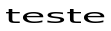
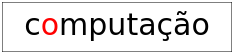
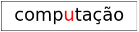
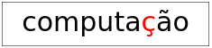

# Introdução

## Introdução

O Spython permite a criação de imagens. \pause

O Spython web permite a criação e exibição de imagens, animações e programas interativos.


## Definições

Uma **imagem** é um dado visual e retangular. \pause Pode ser uma foto, um desenho, uma figura geométrica ou um texto. \pause

Uma **animação** é a exibição contínua de imagens estáticas que variam de forma sequencial criando a ilusão de movimento. \pause

Um **programa interativo** é um programa que reage a ações do usuário modificando seu comportamento e saída de acordo com as entradas recebidas.


## Aviso

Esta parte do Spython é experimental, então pode conter erros. Se você identificar alguma falha, comunique ao professor.


# Imagens

## Introdução

O Spython fornece várias funções para criação de imagens geométricas básicas, como retângulos, elipses, polígonos e textos. Também fornece funções para transformar e combinar imagens, como rotacionar, espelhar, colocar uma ao lado da outra, entre outras. \pause

As funções para criar, combinar e transformar imagens estão no módulo `spython`{.python} e podem ser importadas diretamente. \pause

Uma forma geométrica tem um estilo, que inclui um contorno (_stroke_) e um preenchimento (_fill_). O contorno tem uma cor e uma espessura. O preenchimento pode ou não ter uma cor. \pause

As funções para especificar o estilo são `stroke`{.python} e `fill`{.python}. As cores predefinidas (`red`{.python}, `blue`{.python}, `green`{.python}, etc.) e os construtores `rgb`{.python} e `rgba`{.python} também estão em `spython`{.python}.


## Quadrado e retângulo

```python-image
>>> square(60, stroke(red))  # lado
```

\pause

```python-image
>>> rectangle(20, 60, fill(blue))  # largura e altura
```

\pause

```python-image
>>> rectangle(100, 30, stroke(black), fill(gray))
```


## Dimensões

```python-repl
>>> r = rectangle(20, 60)
```

\pause

```python-repl
>>> width(r)
20
```

\pause

```python-repl
>>> height(r)
60
```


## Círculo e elipse

```python-image
>>> circle(30, stroke(red))  # raio
```

\pause

```python-image
>>> ellipse(30, 50, stroke(purple))  # largura e altura
```


## Linha

```python-image
>>> line(20, 50, stroke(black))  # de (0, 0) até (20, 50); y aumenta para baixo
```

\pause

```python-image
>>> line(20, -50, stroke(olive, width=6))
```


## Polígonos

```python-image
>>> triangle(40, stroke(tan))  # lado
```

\pause

```python-image
>>> right_triangle(30, 60, fill(yellowgreen))  # base e altura
```

\pause

```python-image
>>> isosceles_triangle(60, 150, fill(seagreen))  # lados iguais e ângulo entre eles
```


## Polígonos

```python-image
>>> rhombus(50, 30, stroke(magenta))  # lado e ângulo
```

\pause

```python-image
>>> rhombus(60, 120, fill(cornflowerblue))  # lado e ângulo
```


## Polígonos

```python-image
>>> polygon(
...     [Point(0, 0), Point(-10, 20), Point(60, 0), Point(-10, -20)],
...     fill(burlywood)
... )
```


## Polígonos

```python-image
>>> regular_polygon(60, 5, fill(chocolate))  # lado e número de lados
```

\pause

```python-image
>>> regular_polygon(40, 8, stroke(navy))  # lado e número de lados
```


## Polígonos

```python-image
>>> star(40, fill(firebrick))  # estrela circunscrita em um polígono de lado 40
```

\pause

```python-image
>>> radial_star(9, 20, 40, stroke(darkslategray))  # n. de pontas, raio interno e externo
```


## Polígonos

```python-image
>>> star_polygon(40, 7, 3, stroke(seagreen))  # estrela circunscrita em um polígono
...                                           # de 7 lados, vértices de 3 em 3
```


## Texto

```python-repl
>>> text("Casa", fill(black), size=20)  # texto e tamanho da fonte
```


\pause

```python-repl
>>> text("aTa", stroke(darkgreen), size=30)  # texto e tamanho da fonte
```


## Combinações

```python-image
>>> beside(  # ao lado
...     rectangle(20, 30, fill(blue)),
...     circle(10, fill(red))
... )
```

\pause

```python-image
>>> above(  # acima
...     rectangle(20, 30, fill(blue)),
...     circle(10, fill(red))
... )
```


## Combinações

Ao lado com posicionamento no eixo y. As funções `above`{.python}, `beside`{.python}, `overlay`{.python} e `underlay`{.python} aceitam várias imagens e um alinhamento opcional.

\small

```python-image
>>> beside(
...     ellipse(20, 70, fill(lightsteelblue)),
...     ellipse(20, 50, fill(mediumslateblue)),
...     ellipse(20, 30, fill(slateblue)),
...     ellipse(20, 10, fill(navy)),
...     y_place=BOTTOM,
... )
```

\normalsize

`BOTTOM`{.python}, `TOP`{.python} e `MIDDLE`{.python} são constantes de posicionamento no eixo y.


## Combinações

Acima com posicionamento no eixo x.

\small

```python-image
>>> above(
...     ellipse(70, 20, fill(yellowgreen)),
...     ellipse(50, 20, fill(olivedrab)),
...     ellipse(30, 20, fill(darkolivegreen)),
...     ellipse(10, 20, fill(darkgreen)),
...     x_place=RIGHT,
... )
```

\normalsize

`LEFT`{.python}, `RIGHT`{.python} e `CENTER`{.python} são constantes de posicionamento no eixo x.


## Combinações

Sobreposição.

\small

```python-image
>>> overlay(
...     rectangle(30, 60, fill(orange)),
...     ellipse(60, 30, fill(purple)),
... )
```


## Combinações

Sobreposição com posicionamento no eixo x e y.

\small

```python-image
>>> overlay(
...     rectangle(30, 60, fill(orange)),
...     ellipse(60, 30, fill(purple)),
...     x_place=LEFT, y_place=MIDDLE,
... )
```


## Combinações

\small

Os cantos superiores esquerdos começam no mesmo ponto, a segunda imagem é transladada.

```python-image
>>> overlay_xy(
...     rectangle(40, 60, stroke(red)),
...     25, 10,
...     rectangle(20, 20, fill(black))
... )
```


## Combinações

\small

Coloca o centro da segunda imagem na posição especificada.

```python-image
>>> place_image(
...     square(48, fill(lightgray)),
...     24, 24,
...     triangle(32, fill(red))
... )
```


## Combinações

\small

Coloca o ponto dado por `x_place`{.python} e `y_place`{.python} da segunda imagem na posição especificada.

```python-image
>>> place_image(
...     rectangle(64, 64, fill(palegoldenrod)),
...     64, 64,
...     triangle(48, fill(yellowgreen)),
...     x_place=RIGHT, y_place=BOTTOM,
... )
```


## Transformações

Escala.

```python-image
>>> beside(
...     scale(ellipse(20, 30, fill(blue)), 2),
...     ellipse(40, 60, fill(blue))
... )
```

\pause

```python-repl
>>> scale_xy(text("teste", fill(black), size=16), 2.5, 1.2)
```




## Transformações

Rotaciona no sentido anti-horário.

```python-image
>>> rotate(rectangle(20, 60, fill(blue)), 30)
```


## Transformações

Espelha na horizontal.

\small

```python-image
>>> beside(
...     rotate(square(50, fill(red)), 30),
...     flip_horizontal(rotate(square(50, fill(blue)), 30))
... )
```


## Transformações

Espelha na vertical.

\small

```python-image
>>> above(
...     star(40, fill(firebrick)),
...     scale_xy(flip_vertical(star(40, fill(gray))), 1.0, 0.5)
... )
```


## Utilidades

Coloca um quadro ao redor da imagem, útil para depuração.

```python-image
>>> frame(star(30, stroke(firebrick)))
```

\pause

Cria um quadro que pode ser usado como fundo para colocar outras imagens.

```python-image
>>> empty_scene(70, 50)
```


## Construindo uma casa

Uma casa simples.

\small

```python-image
>>> above(
...     triangle(40, fill(red)),
...     rectangle(40, 30, fill(black))
... )
```


## Construindo uma casa

Uma casa com dois telhados.

\small

```python-image
>>> above(
...     beside(triangle(40, fill(red)), triangle(40, fill(red))),
...     rectangle(80, 30, fill(black))
... )
```


## Construindo uma casa

Se os telhados não forem do mesmo tamanho, eles não ficam alinhados.

\small

```python-image
>>> above(
...     beside(triangle(40, fill(red)), triangle(30, fill(red))),
...     rectangle(70, 30, fill(black))
... )
```


## Construindo uma casa

Para alinhar telhados de tamanhos diferentes, passamos `y_place=BOTTOM`{.python} para `beside`{.python}.

\small

```python-image
>>> above(
...     beside(triangle(40, fill(red)), triangle(30, fill(red)), y_place=BOTTOM),
...     rectangle(70, 30, fill(black)),
... )
```


## Construindo uma casa

Colocando uma porta.

\small

```python-repl
>>> casa = above(
...     beside(triangle(40, fill(red)), triangle(30, fill(red)), y_place=BOTTOM),
...     rectangle(70, 30, fill(black)),
... )
>>> porta = rectangle(15, 25, fill(saddlebrown))
```

```python-image
casa = above(
    beside(triangle(40, fill(red)), triangle(30, fill(red)), y_place=BOTTOM),
    rectangle(70, 30, fill(black)),
)
porta = rectangle(15, 25, fill(saddlebrown))

>>> overlay(porta, casa, y_place=BOTTOM)
```


## Construindo uma casa

Colocando uma porta, agora com maçaneta.

\small

```python-repl
>>> porta_macaneta = overlay(
...     circle(3, fill(yellow)),
...     porta,
...     x_place=RIGHT,
... )
```

```python-image
casa = above(
    beside(triangle(40, fill(red)), triangle(30, fill(red)), y_place=BOTTOM),
    rectangle(70, 30, fill(black)),
)
porta = rectangle(15, 25, fill(saddlebrown))
porta_macaneta = overlay(circle(3, fill(yellow)), porta, x_place=RIGHT)

>>> overlay(porta_macaneta, casa, y_place=BOTTOM)
```


## Salvando imagens

No Spython (linha de comando) é possível salvar uma imagem no formato svg. \pause

Por exemplo, dado o arquivo `estrela.py`{.python} abaixo

\small

```python
from spython import star, fill, firebrick, to_svg


def main() -> None:
    print(to_svg(star(40, fill(firebrick))))
```

\pause

\normalsize

Execute

\small

```sh
spython run estrela.py > estrela.svg
```


## Cores


## Cores

Cores também podem ser criadas usando valores rgb ou rgba.

\footnotesize

```python-repl
>>> verde = rgb(0, 255, 0)            # valores entre 0 e 255
>>> laranja = rgba(255, 165, 0, 0.7)  # opacidade entre 0 e 1
```

\pause

```python-image
verde = rgb(0, 255, 0)
laranja = rgba(255, 165, 0, 0.7)

>>> underlay_xy(
...     circle(30, fill(verde), stroke(rgb(100, 100, 100), width=5)),
...     30, 0,
...     circle(30, fill(laranja))
... )
```


# Animações

## Animações

Uma **animação** é a exibição contínua de imagens estáticas que variam de forma sequencial criando a ilusão de movimento. \pause

A animação mais simples no Spython é uma simulação baseada no tempo. O trabalho do programador é providenciar uma função que cria uma imagem a partir de um número natural. \pause

A função de animação é `animate`{.python}.

```python
def animate(create_image: Callable[[int], Image]) -> None
```

\pause

O relógio da animação faz 28 tiques por segundo, a cada tique a função `create_image`{.python} é chamada com o número de tiques passados desde o início da animação.


## Exemplo óvni

Vamos criar uma animação de um óvni descendo a tela (veja o arquivo `animacao_ovni.py`{.python}).


## Exemplo óvni

\footnotesize

```python
def cena_ovni(tick: int) -> Image:
    ovni = overlay(circle(10, fill(green)), rectangle(40, 4, fill(green)))
    return place_image(empty_scene(100, 100), 50, tick, ovni)
```

\pause

<div class="columns">
<div class="column" width="33%">
\footnotesize

```python-image
def cena_ovni(tick: int) -> Image:
    ovni = overlay(circle(10, fill(green)), rectangle(40, 4, fill(green)))
    return place_image(empty_scene(100, 100), 50, tick, ovni)

>>> cena_ovni(10)
```

\pause
</div>
<div class="column" width="33%">
\footnotesize

```python-image
def cena_ovni(tick: int) -> Image:
    ovni = overlay(circle(10, fill(green)), rectangle(40, 4, fill(green)))
    return place_image(empty_scene(100, 100), 50, tick, ovni)

>>> cena_ovni(40)
```

\pause
</div>
<div class="column" width="33%">
\footnotesize

```python-image
def cena_ovni(tick: int) -> Image:
    ovni = overlay(circle(10, fill(green)), rectangle(40, 4, fill(green)))
    return place_image(empty_scene(100, 100), 50, tick, ovni)

>>> cena_ovni(76)
```

\pause
</div>
</div>

```python
def main() -> None:
    animate(cena_ovni)
```


## Exemplo texto com uma letra colorida

Vamos criar uma animação que colore uma letra de um texto por vez (veja o arquivo `animacao_texto.py`{.python}).


## Exemplo texto com uma letra colorida

\footnotesize

```python
def cena_texto(tick: int) -> Image:
    palavra = 'computação'
    # dividimos por 10 para desacelerar a animação
    i = tick // 10 % len(palavra)
    inicio = palavra[:i]
    letra = palavra[i:i + 1]
    fim = palavra[i + 1:]
    t = beside(text(inicio, fill(black), size=30), text(letra, fill(red), size=30))
    t = beside(t, text(fim, fill(black), size=30))
    return overlay(t, empty_scene(230, 50))
```

\pause

<div class="columns">
<div class="column" width="33%">
\footnotesize

```python-repl
>>> cena_texto(10)
```



\pause
</div>
<div class="column" width="33%">
\footnotesize

```python-repl
>>> cena_texto(40)
```



\pause
</div>
<div class="column" width="33%">
\footnotesize

```python-repl
>>> cena_texto(76)
```



</div>
</div>


# Programas interativos

## Programas interativos

Um **programa interativo** é um programa que reage a ações do usuário modificando seu comportamento e saída de acordo com as entradas recebidas.

\pause

Para projetar um programa interativo é necessário definir três coisas: \pause

- Definição do estado do programa e constantes; \pause
- Uma função que gera uma imagem a partir do estado do programa; \pause
- Uma função que modifica o estado do programa a partir de um evento de teclado. \pause

Opcionalmente,

- Uma função que avança o estado do programa com o passar do tempo.


## Exemplo movimento horizontal

Vamos criar um programa que exibe um quadrado que pode ser deslocado para a esquerda ou direita usando as teclas apropriadas e que alterna a cor entre verde, amarelo e vermelho a cada segundo (veja o arquivo `move_horizontal.py`{.python}). \pause

Começamos com um esboço do que queremos.


## Exemplo movimento horizontal


\pause

O que precisamos para representar o estado do programa? \pause O que muda com as interações ou com o tempo? \pause A coordenada x do centro do quadrado. \pause A cor. \pause Vamos definir uma estrutura. \pause

O que não muda? \pause O tamanho da cena e do quadrado. \pause A coordenada y do centro do quadrado. \pause A coordenada x inicial do centro do quadrado. \pause O deslocamento em cada interação.


## Exemplo movimento horizontal

<div class="columns">
<div class="column" width="48%">

Estado do programa.

\footnotesize

```python
class Cor(Enum):
    VERDE = auto()
    AMARELO = auto()
    VERMELHO = auto()


@dataclass
class Quadrado:
    x: int
    cor: Cor
```

\pause

</div>
<div class="column" width="48%">

Constantes.

\footnotesize

```python
LARGURA = 100
ALTURA = 100
DESLOCAMENTO = 10
Q_LADO = 20
Q_Y = 50
Q_X_INICIAL = 50
```

</div>
</div>


## Exemplo movimento horizontal

Função que gera uma imagem a partir do estado.

<div class="columns">
<div class="column" width="48%">

\scriptsize

```python
def desenha(q: Quadrado) -> Image:
    return put_image(
        empty_scene(LARGURA, ALTURA),
        q.x, Q_Y,
        square(Q_LADO, fill(cor_para_fill(q.cor)))
    )
```

\pause

</div>
<div class="column" width="48%">

\scriptsize

```python
def cor_para_fill(cor: Cor) -> Color:
    if cor == Cor.VERDE:
        return green
    elif cor == Cor.VERMELHO:
        return red
    else:
        return yellow
```

</div>
</div>


## Exemplo movimento horizontal

\small

Função que modifica o estado a partir de um evento de teclado.

<div class="columns">
<div class="column" width="48%">

\scriptsize

```python
def move(q: Quadrado, tecla: str) -> Quadrado:
    """
    Desloca *q* para a esquerda (subtrai
    *DESLOCAMENTO* de *x*)se *tecla* for
    "ArrowLeft" e para a direita (soma
    *DESLOCAMENTO* a *x*) se *tecla* for
    "ArrowRight". Devolve *q* para outras teclas.

    >>> move(Quadrado(50, Cor.VERDE), 'ArrowLeft')
    Quadrado(x=40, cor=<Cor.VERDE: 1>)
    >>> move(Quadrado(50, Cor.VERDE), 'ArrowRight')
    Quadrado(x=60, cor=<Cor.VERDE: 1>)
    >>> move(Quadrado(50, Cor.VERDE), 'Space')
    Quadrado(x=50, cor=<Cor.VERDE: 1>)
    """
```

\pause

</div>
<div class="column" width="48%">

\scriptsize

```python
def move(q: Quadrado, tecla: str) -> Quadrado:
    if tecla == 'ArrowLeft':
        return Quadrado(q.x - DESLOCAMENTO, q.cor)
    elif tecla == 'ArrowRight':
        return Quadrado(q.x + DESLOCAMENTO, q.cor)
    else:
        return q
```

</div>
</div>


## Exemplo movimento horizontal

\small

Função que modifica a cor com a passagem do tempo.

<div class="columns">
<div class="column" width="48%">

\scriptsize

```python
def muda_cor(q: Quadrado) -> Quadrado:
    """
    Muda a cor de *q* da seguinte forma:
    Verde -> Amarelo, Amarelo -> Vermelho,
    Vermelho -> Verde

    >>> muda_cor(Quadrado(50, Cor.VERDE))
    Quadrado(x=50, cor=<Cor.AMARELO: 2>)
    >>> muda_cor(Quadrado(50, Cor.AMARELO))
    Quadrado(x=50, cor=<Cor.VERMELHO: 3>)
    >>> muda_cor(Quadrado(50, Cor.VERMELHO))
    Quadrado(x=50, cor=<Cor.VERDE: 1>)
    """
```

\pause

</div>
<div class="column" width="48%">

\footnotesize

```python
def muda_cor(q: Quadrado) -> Quadrado:
    if q.cor == Cor.VERDE:
        nova = Cor.AMARELO
    elif q.cor == Cor.AMARELO:
        nova = Cor.VERMELHO
    else:
        nova = Cor.VERDE
    return Quadrado(q.x, nova)
```

</div>
</div>


## Exemplo movimento horizontal

\footnotesize

```python
def main() -> None:
    # Cria um mundo com um estado inicial e uma função de desenho
    mundo = World(Quadrado(Q_X_INICIAL, Cor.VERDE), desenha)
    # move atualiza o estado quando uma tecla é pressionada
    mundo.on_key_down(move)
    # muda_cor atualiza o estado a cada tique de relógio
    mundo.on_tick(muda_cor)
    # quantas vezes o relógio faz tique por segundo
    mundo.tick_rate(1)
    mundo.run()
```

<!--
\normalsize

Os métodos têm as seguintes assinaturas:

\footnotesize

```python
class World[T]:
    def __init__(self, state: T, to_image: Callable[[T], Image]) -> None
    def on_key_down(self, handler: Callable[[T, str], T]) -> World[T]
    def on_tick(self, handler: Callable[[T], T]) -> World[T]
    def tick_rate(self, rate: int) -> World[T]
    def run(self) -> None
```
-->


## Teclas

A tecla recebida pelos handlers é uma string. \pause As teclas especiais têm nomes padronizados:

<div class="columns">
<div class="column" width="33%">
\small

```python
'ArrowLeft'
'ArrowRight'
'ArrowUp'
'ArrowDown'
'PageUp'
'PageDown'
'Home'
'End'
'Backspace'
'Tab'
'Enter'
'Escape'
```

</div>
<div class="column" width="33%">

\small

```python
'Delete'
'Insert'
'F1'
'F2'
'F3'
'F4'
'F5'
'F6'
'F7'
'F8'
'F9'
'F10'
'F11'
```

</div>
<div class="column" width="33%">

\small

```python
'F12'
'CapsLock'
'NumLock'
'ScrollLock'
'PrintScreen'
'Pause'
'Shift'
'Control'
'Alt'
'Meta'
' '  # espaço
'a', 'b', ...
```

</div>
</div>


# Revisão

## Revisão

O que é uma imagem? \pause

- Um dado visual e retangular: foto, desenho, figura geométrica ou texto. \pause

Onde estão as funções para criar, combinar e transformar imagens no Spython? \pause

- No módulo `spython`{.python} (acessível via `from spython import ...`{.python}). \pause

Como especificamos o estilo de uma forma geométrica? \pause

- Com `stroke(cor)`{.python} para o contorno e `fill(cor)`{.python} para o preenchimento; podem ser passados juntos como argumentos da função que cria a forma.


## Revisão

O que é uma animação? \pause

- A exibição contínua de imagens estáticas que variam sequencialmente criando a ilusão de movimento. \pause

Como criamos uma animação no Spython? \pause

- Com `animate(create_image)`{.python}, onde `create_image`{.python} é uma função que recebe o número do tique e devolve uma imagem. \pause

Quantos tiques por segundo o relógio da animação faz? \pause

- 28.


## Revisão

O que é um programa interativo? \pause

- Um programa que reage a ações do usuário modificando seu comportamento e saída de acordo com as entradas recebidas. \pause

O que precisamos definir para projetar um programa interativo? \pause

- Estado do programa e constantes; uma função de desenho; um handler de eventos de teclado; e, opcionalmente, um handler que avança o estado a cada tique. \pause

Como criamos um programa interativo no Spython? \pause

- Construímos um `World(estado, desenha)`{.python}, registramos handlers com `on_key_down`{.python}, `on_tick`{.python} e `tick_rate`{.python}, e finalizamos com `run()`{.python}.
